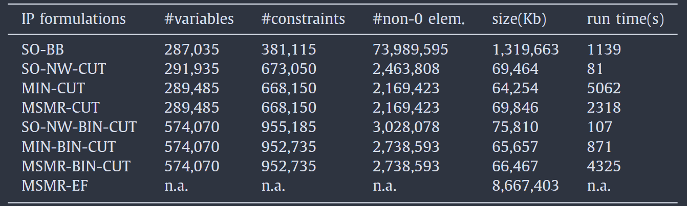
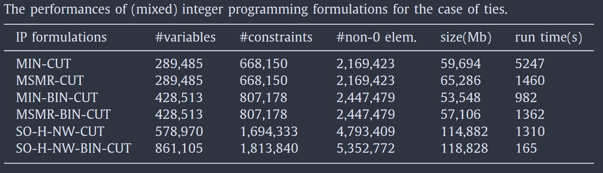
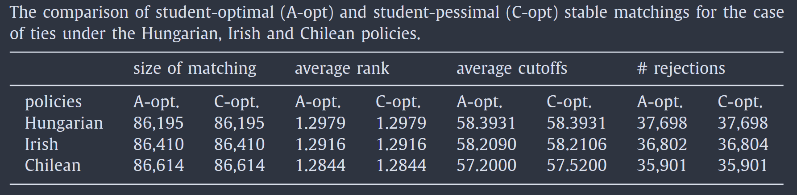

# فاز اول - تشریح مسئله

این مقاله سعی دارد با ارائه‌ی یک مدل ترکیبیاتی، مسئله‌ی پذیرش دانشگاهی در مجارستان را حل کند. در این سیستم دانشجویان بر اساس نمرات خود که در بازه $[0, 500]$ قرار دارند رتبه‌بندی می‌شوند و هر دانشجو یک لیست از ترجیحات خود برای برنامه‌های دانشگاهی متفاوت انتخاب می‌کند.
در سال ۱۹۶۲ گیل و شپلی یک روش استاندارد برای حل مسئله‌ی پذیرش دانشگاه ارائه دادند که با الگوریتم deferred-acceptance یک  «تطابق پایدار» در زمان خطی پیدا می‌کرد. به‌صورت شهودی،‌ تطابق پایدار زمانی است که یک درخواست پذیرش زمانی رد شود که آن دانشگاه با متقاضیانی با رتبه‌های بهتر پر شده باشد.
اما تمرکز این مقاله بر چند ویژگی مهم در سیستم مجارستان است که باعث می‌شود روش گیل و شپلی کارآمد نباشد؛

1. **رتبه‌های مساوی (Ties)**: زمانی که دو یا چند دانشجو نمره یکسانی در یک برنامه دارند. در مجارستان، یا همه دانشجویان با نمره مساوی پذیرفته می‌شوند یا همه رد می‌شوند.
2. **سهمیه‌های پایین‌تر (Lower Quotas)**: حداقل تعداد دانشجوی مورد نیاز برای هر برنامه که توسط دانشگاه‌ها برای اقتصادی کردن آموزش تعیین می‌شود.
3. **سهمیه‌های مشترک (Common Quotas)**:
    - سهمیه‌های دانشکده‌ای برای هر برنامه
    - سهمیه‌های ملی برای تعداد دانشجویان با بودجه دولتی در هر رشته
4. **درخواست‌های زوجی (Paired Applications)**: دانشجویانی که برای برنامه‌های معلمی درخواست می‌دهند باید برای جفت برنامه‌ها (مانند ریاضی-فیزیک) درخواست دهند.

ویژگی سهمیه‌های مشترک باعث‌ می‌شود که مسئله NP-hard باشد و به‌صورت کارا قابل نباشد. وجود سهمیه‌های مشترک (به همراه سهمیه‌های پایین‌تر و درخواست‌های زوجی) باعث NP-hard شدن مسئله می‌شود. بنابراین هدف این مقاله ارائه‌ی فرمول‌بندی‌های برنامه‌ریزی عدد صحیح است که هم برای مقایسه‌ی سیاست‌های مختلف رتبه‌های مساوی و هم برای حل عملی حالت NP-hard سهمیه‌های مشترک در مقیاس واقعی کاربردی باشند.

این پروژه به صورت تک‌نفره انجام شده و بنابراین این گزارش فقط شامل ۴ بخش اول مقاله می‌شود، در این بخش‌ها از ویژگی‌های مهم سیستم مجارستان، فقط «رتبه‌های مساوی» مورد بررسی قرار می‌گیرد.

## سیاست‌های برخورد با رتبه‌های مساوی

در این مقاله، سه سیاست مختلف برای مواجهه با رتبه‌های مساوی (در حالتی که تعداد موقعیت‌های خالی، کم‌تر از متقاضیان با رتبه‌ی مساوی باشد.) بررسی می‌شود:

#### سیاست مجارستان

در این سیاست، اگر تعداد دانشجویان با نمره مساوی در آخرین گروه بیشتر از ظرفیت باقیمانده باشد، همه آنها رد می‌شوند. این سیاست با نام H-stability نیز شناخته می‌شود.

#### سیاست شیلی

در این سیاست، اگر دانشجویان با نمره مساوی در آخرین گروه بیشتر از ظرفیت باقیمانده باشند، همه آنها پذیرفته می‌شوند، حتی اگر این امر منجر به نقض ظرفیت شود. این سیاست با نام L-stability نیز شناخته می‌شود.

#### سیاست ایرلند

در این سیاست، یک قرعه‌کشی انجام می‌شود تا مشخص شود کدام یک از دانشجویان با نمره مساوی در آخرین گروه پذیرفته شوند.

## نمادهای پایه

این نمادها برای فهم بهتر مفاهیم اولیه قرار داده شده است. توضیح مفصل تمام نمادها در فاز دوم پروژه قرار دارد.

- **مجموعه متقاضیان**: $A = \{a_1, a_2, ..., a_n\}$ که شامل تمام دانشجویان متقاضی است.
- **مجموعه دانشگاه‌ها**: $C = \{c_1, c_2, ..., c_m\}$ که شامل تمام برنامه‌های دانشگاهی است.
	- **ایندکس‌ها**: $i = 1, ..., n$ برای دانشجویان و $j = 1, ..., m$ برای دانشگاه‌ها.
- **مجموعه درخواست‌ها**: $E \subseteq A \times C$ که شامل تمام درخواست‌های دانشجویان به دانشگاه‌هاست.
- **رتبه درخواست**: $r_{ij}$ نشان‌دهنده رتبه درخواست $(a_i, c_j)$ در لیست ترجیحات دانشجو $a_i$ است. (هرچه کمتر، اولویت بالاتر)
- **نمره دانشجو**: $s_{ij}$ نشان‌دهنده نمره دانشجو $a_i$ در دانشگاه $c_j$ است. (هرچه بیشتر، رتبه بهتری دارد)
- **ظرفیت دانشگاه**: $u_j$ نشان‌دهنده حداکثر تعداد دانشجوی قابل پذیرش در دانشگاه $c_j$ است.
- **تطابق**: $M \subseteq E$ مجموعه‌ای از درخواست‌های پذیرفته‌شده.
   - **مجموعه‌ی دانشجوهای تطابق**: با $M(c_{j})$ نشان می‌دهیم و شامل متقاضیانی است که در دانشگاه $c_{j}$ پذیرفته شده اند.
   - **مجموعه‌ی دانشگاه‌های تطابق**:با $M(a_{i})$ نشان می‌دهیم و شامل دانشگاه‌هایی است که متقاضی $a_{i}$ را پذیرفتند. (باید همواره یک عضو داشته باشد یا مجموعه‌ی تهی باشد.)

## مفاهیم اولیه
### تطابق و تطابق پایدار

یک تطابق (Matching) به مجموعه‌ای از درخواست‌های پذیرفته شده گفته می‌شود که در آن:

1. هر دانشجو حداکثر به یک دانشگاه پذیرفته شود: $|M(a_i)| \leq 1$
2. هر دانشگاه حداکثر به اندازه ظرفیت خود دانشجو بپذیرد: $|M(c_j)| \leq u_j$

یک تطابق $M$ پایدار (Stable) است اگر برای هر درخواست $(a_i, c_j) \notin M$ که در تطابق وجود ندارد، حداقل یکی از دو شرط زیر برقرار باشد:

- دانشجو $a_i$ دانشگاه فعلی خود (یعنی $M(a_i)$) را به دانشگاه $c_j$ ترجیح دهد.
- یا دانشگاه $c_j$ تمام $u_j$ صندلی خود را با دانشجویانی پر کرده باشد که نمرات بالاتری از $a_i$ دارند (یعنی $s_{hj} > s_{ij}$).

### نمره برش

**نمرات برش** (Cutoff Scores) یکی از مفاهیم کلیدی در این مقاله است. برای هر دانشگاه $c_j$، یک نمره برش $t_j$ تعریف می‌شود. و $\mathbf{t}$ بردار تمام نمرات برش را نشان دهد.

- یک دانشجو $a_i$ در دانشگاه $c_j$ **قابل پذیرش** است اگر $s_{ij} \geq t_j$.
- یک تطابق $M$ توسط نمرات برش $\mathbf{t}$ القا می‌شود (Implied) اگر هر دانشجو به بهترین دانشگاه در لیست ترجیحات خود که در آن قابل پذیرش است، پذیرفته شود.

### حسادت

در یک تطابق $M$، دانشجو $a_i$ نسبت به دانشجو $a_k$ در دانشگاه $c_j$ **حسادت موجه (Justified Envy)** دارد اگر:
1. $M(a_k) = c_j$ (یعنی $a_k$ به $c_j$ پذیرفته شده است)
2. $a_i$ دانشگاه $c_j$ را به $M(a_i)$ ترجیح دهد
3. $a_i$ در دانشگاه $c_j$ رتبه بالاتری از $a_k$ داشته باشد (یعنی $s_{ij} > s_{kj}$)

تطابقی که در آن هیچ حسادت موجهی وجود نداشته باشد، **بدون حسادت (Envy-Free)** نامیده می‌شود.

### اسراف (Wastefulness)

یک تطابق $M$ اسراف‌آمیز است اگر دانشجویی مانند $a_i$ وجود داشته باشد که دانشگاه $c_j$ را به $M(a_i)$ ترجیح دهد، در حالی که دانشگاه $c_j$ هنوز ظرفیت خالی داشته باشد (یعنی $|M(c_j)| < u_j$).

### تابع انتخاب

برای دانشگاه $c_j$ و مجموعه‌ای از درخواست‌ها $X \subset E$، تابع انتخاب $Ch_j(X) \subseteq X$ مجموعه درخواست‌های انتخاب‌شده توسط دانشگاه را مشخص می‌کند.

- برای رتبه‌بندی دقیق (بدون رتبه مساوی):
   - اگر $|X| \leq u_j$، آنگاه $Ch_j(X) = X$
   - اگر $|X| > u_j$، آنگاه $u_j$ دانشجوی برتر بر اساس نمرات انتخاب می‌شوند.

- برای حالت رتبه‌های مساوی، دو تابع انتخاب تعریف می‌شوند:
   - $Ch_j^H$: مربوط به سیاست مجارستان (محدودکننده)
   - $Ch_j^C$: مربوط به سیاست شیلی (انعطاف‌پذیر)

برای نمره برش $t_j$، مجموعه $X^{\geq t_j}$ به زیرمجموعه‌ای از درخواست‌ها در $X$ گفته می‌شود که دانشجویان دارای نمره $t_j$ یا بالاتر در دانشگاه $c_j$ هستند.

**سیاست مجارستان (محدودکننده):**
$$
Ch_j^H(X) = X^{\geq t_j} \quad \text{so that} \quad |X^{\geq t_j}| \leq u_j \quad \text{and} \quad |X^{\geq t_j - 1}| > u_j
$$
یعنی تعداد دانشجویان انتخاب‌شده هرگز از ظرفیت بیشتر نمی‌شود، اما نمره برش حداقل است، به‌طوری که کاهش یک واحدی آن منجر به نقض ظرفیت می‌شود.

**سیاست شیلی (انعطاف‌پذیر):**
$$
Ch_j^C(X) = X^{\geq t_j} \quad \text{so that} \quad |X^{\geq t_j}| \geq u_j \quad \text{and} \quad |X^{\geq t_j + 1}| < u_j
$$
یعنی تعداد دانشجویان انتخاب‌شده حداقل به اندازه ظرفیت است (و ممکن است بیشتر باشد)، اما نمره برش حداکثر است، به‌طوری که افزایش یک واحدی آن منجر به خالی ماندن صندلی می‌شود.

## قضایای اثبات‌شده
### قضیه نمرات برش در تطابق پایدار

بر اساس نتایج مقاله Biro & Kiselgof (2015)، اگر تطابق‌های پایدار بهینه برای دانشجویان در سه سیاست فوق مقایسه شوند:

> نمرات برش در مجارستان ≥ نمرات برش در ایرلند ≥ نمرات برش در شیلی

به عبارت دیگر:
- دانشجویان در مجارستان بدترین تطابق ممکن را دریافت می‌کنند.
- دانشجویان در ایرلند تطابق بهتری نسبت به مجارستان دریافت می‌کنند.
- دانشجویان در شیلی بهترین تطابق ممکن را دریافت می‌کنند.

### قضیای مربوط به حسادت


> [!info] قضایای اثبات‌شده
> - یک تطابق پایدار است اگر و فقط اگر بدون حسادت و غیراسراف‌آمیز باشد.
> - یک تطابق بدون حسادت است اگر و فقط اگر توسط نمرات برش القا شود.

برای دستیابی به تطابق پایدار بهینه برای دانشجویان، می‌توان از تابع هدف مناسب برای انتخاب بهترین تطابق بدون حسادت و غیراسراف استفاده کرد.

### قضایای بخش سه

> [!info] قضایای اثبات‌شده
> - قضیه ۱ (Proposition 1): یک تطابق در مسئله پذیرش با رتبه‌های مساوی بدون حسادت (Envy-Free) است اگر و فقط اگر توسط نمرات برش القا شود.
> - قضیه ۲ (Proposition 2): در مسئله پذیرش با رتبه‌های مساوی، تطابق پایدار بهینه برای دانشجویان با سیاست رفتار برابر مجارستان (یا شیلی)، همچنین تطابق بهینه برای دانشجویان در میان تطابق‌های بدون حسادت است.

# فاز دوم - نمادهای به‌کار رفته

## مجموعه‌ها

| نماد  | توضیحات                                                                                                          | استفاده                        |
| :---: | :--------------------------------------------------------------------------------------------------------------- | :----------------------------- |
|  $A$  | مجموعه متقاضیان (دانشجویان)                                                                                      | تمام فرمول‌بندی‌ها             |
|  $C$  | مجموعه دانشگاه‌ها (برنامه‌های دانشگاهی)                                                                          | تمام فرمول‌بندی‌ها             |
|  $E$  | مجموعه درخواست‌ها، زیرمجموعه‌ای از $A \times C$                                                                  | تمام فرمول‌بندی‌ها             |
| $S_j$ | مجموعه نمرات متفاوت در دانشگاه $c_j$، به صورت $S_j = \{s_j^1, s_j^2, \ldots, s_j^{m_j}\}$ به صورت صعودی مرتب‌شده | فرمول‌بندی‌های دودویی نمره برش |
| $E_i$ | مجموعه درخواست‌های دانشجو $a_i$                                                                                  | -                              |

## اندیس‌ها

| نماد | توضیحات                                            | محدوده                   |
| :--: | :------------------------------------------------- | :----------------------- |
| $i$  | اندیس دانشجو                                       | $i = 1, \ldots, n$       |
| $j$  | اندیس دانشگاه                                      | $j = 1, \ldots, m$       |
| $k$  | اندیس نمره در مجموعه $S_j$                         | $k = 1, \ldots, \|S_j\|$ |
| $h$  | اندیس کمکی برای دانشجویان (در مقایسه نمرات)        | $h = 1, \ldots, n$       |

## پارامترها

|     نماد      | توضیحات                                                                              | استفاده                        |
| :-----------: | :----------------------------------------------------------------------------------- | :----------------------------- |
|     $u_j$     | ظرفیت بالایی دانشگاه $c_j$ (حداکثر تعداد دانشجوی قابل پذیرش)                         | تمام فرمول‌بندی‌ها             |
|     $u_p$     | ظرفیت بالایی سهمیه مشترک $C_p$                                                       | فرمول‌بندی‌های با سهمیه مشترک  |
|   $r_{ij}$    | رتبه درخواست $(a_i, c_j)$ در لیست ترجیحات دانشجو $a_i$ (عدد کوچک‌تر = اولویت بالاتر) | تمام فرمول‌بندی‌ها             |
|   $s_{ij}$    | نمره دانشجو $a_i$ در دانشگاه $c_j$ (عدد بزرگ‌تر = رتبه بهتر)                         | تمام فرمول‌بندی‌ها             |
|    $s_j^k$    | $k$امین نمره در مجموعه $S_j$ (مرتب‌شده صعودی)                                        | فرمول‌بندی‌های دودویی نمره برش |
|   $\bar{s}$   | کران بالای نمرات (در مجارستان مقدار ۵۰۰)                                             | فرمول‌بندی‌های پیوسته نمره برش |
| $\varepsilon$ | عدد مثبت بسیار کوچک (برای ایجاد نامساوی اکید)                                        | فرمول‌بندی‌های پیوسته نمره برش |
|      $K$      | عدد ثابت بزرگ (برای تابع هدف وزنی)                                                   | فرمول‌بندی‌های MSMR            |
| $\bar{s} + 1$ | کران بالای نمرات به علاوه یک (برای فعال/غیرفعال کردن قیدها)                          | فرمول‌بندی‌های پیوسته نمره برش |

## متغیرهای تصمیم

متغیرهای اصلی پذیرش:

|   نماد   |  نوع   | توضیحات                                                   | محدوده     | استفاده            |
| :------: | :----: | :-------------------------------------------------------- | :--------- | :----------------- |
| $x_{ij}$ | دودویی | ۱ اگر درخواست $(a_i, c_j)$ پذیرفته شود، در غیر این صورت ۰ | $\{0, 1\}$ | تمام فرمول‌بندی‌ها |
متغیرهای نمره برش:

|  نماد   |  نوع   | توضیحات                                                                                                                                                                    | محدوده       | استفاده                                                                                                     |
| :-----: | :----: | :------------------------------------------------------------------------------------------------------------------------------------------------------------------------- | :----------- | :---------------------------------------------------------------------------------------------------------- |
|  $t_j$  | پیوسته | نمره برش دانشگاه $c_j$                                                                                                                                                     | $t_j \geq 0$ | فرمول‌بندی‌های پیوسته نمره برش (SO-NW-CUT, MIN-CUT, MSMR-CUT, SO-H-NW-CUT, SO-C-NW-CUT)                     |
| $t_j^k$ | دودویی | متغیر نمره برش دودویی برای سطح نمره $s_j^k$ در دانشگاه $c_j$<br>$t_j^k = 0$ یعنی نمره برش از $s_j^k$ بزرگ‌تر است<br>$t_j^k = 1$ یعنی نمره برش کوچک‌تر یا مساوی $s_j^k$ است | $\{0, 1\}$   | فرمول‌بندی‌های دودویی نمره برش (SO-NW-BIN-CUT, MIN-BIN-CUT, MSMR-BIN-CUT, SO-H-NW-BIN-CUT, SO-C-NW-BIN-CUT) |
متغیرهای کمکی برای عدم اسراف:

| نماد | نوع | توضیحات | محدوده | محل استفاده |
|:----:|:---:|:-------------|:-------|:-----------|
| $f_j$ | دودویی | ۱ اگر دانشگاه $c_j$ دانشجویی را رد کند (یعنی اساساً پر باشد)، در غیر این صورت ۰ | $\{0, 1\}$ | فرمول‌بندی‌های SO-NW-CUT, SO-H-NW-CUT, SO-C-NW-CUT |
متغیرهای کمکی برای سیاست مجارستان (کاهش نمره برش):

| نماد | نوع | توضیحات | محدوده | محل استفاده |
|:----:|:---:|:-------------|:-------|:-----------|
| $d_{ij}$ | دودویی | ۱ اگر دانشجو $a_i$ در صورت کاهش یک واحدی نمره برش دانشگاه $c_j$، به آن دانشگاه پذیرفته می‌شد، در غیر این صورت ۰ | $\{0, 1\}$ | فرمول‌بندی‌های SO-H-NW-CUT و SO-H-NW-BIN-CUT |
متغیرهای کمکی برای سیاست شیلی (افزایش نمره برش):

| نماد | نوع | توضیحات | محدوده | محل استفاده |
|:----:|:---:|:-------------|:-------|:-----------|
| $\bar{d}_{ij}$ | دودویی | ۱ اگر دانشجو $a_i$ به دانشگاه $c_j$ پذیرفته شده باشد، اما در صورت افزایش یک واحدی نمره برش، از آن دانشگاه رد می‌شد (یعنی در آستانه نمره برش قرار دارد)، در غیر این صورت ۰ | $\{0, 1\}$ | فرمول‌بندی‌های SO-C-NW-CUT و SO-C-NW-BIN-CUT |
## توابع هدف

|      نام      |                         تابع هدف                         | توضیحات                                                                                                | استفاده                                                                                     |
| :-----------: | :------------------------------------------------------: | :----------------------------------------------------------------------------------------------------- | :------------------------------------------------------------------------------------------ |
| تابع هدف (۴)  |    $\min \sum_{(a_i, c_j) \in E} r_{ij} \cdot x_{ij}$    | کمینه‌سازی مجموع رتبه‌های پذیرش = انتخاب تطابق پایدار بهینه برای دانشجویان                             | SO-BB, SO-NW-CUT, SO-NW-BIN-CUT                                                             |
| تابع هدف (۹)  |               $\min \sum_{c_j \in C} t_j$                | کمینه‌سازی مجموع نمرات برش = اعمال شرط عدم اسراف و انتخاب تطابق بهینه                                  | MIN-CUT                                                                                     |
| تابع هدف (۱۰) | $\max \sum_{(a_i, c_j) \in E} (K - r_{ij}) \cdot x_{ij}$ | بیشینه‌سازی مجموع وزنی پذیرش‌ها (با وزن $K - r_{ij}$) = هم بیشینه‌سازی اندازه تطابق و هم بهبود رتبه‌ها | MSMR-CUT, MSMR-BIN-CUT, SO-H-NW-CUT, SO-H-NW-BIN-CUT, SO-C-NW-CUT, SO-C-NW-BIN-CUT, MSMR-EF |
| تابع هدف (۱۵) |    $\max \sum_{c_j \in C} \sum_{k=1}^{\|S_j\|} t_j^k$    | بیشینه‌سازی مجموع متغیرهای نمره برش دودویی = کمینه‌سازی نمرات برش و اعمال عدم اسراف                    | MIN-BIN-CUT                                                                                 |
## نمادهای مفهومی (خارج از فرمول‌بندی‌ها)

|      نماد      | توضیحات                                                                    | محل استفاده        |
| :------------: | :------------------------------------------------------------------------------- | :----------------- |
|      $M$       | تطابق (Matching)، مجموعه‌ای از درخواست‌های پذیرفته‌شده                           | تعاریف و قضایا     |
|    $M(a_i)$    | دانشگاهی که دانشجو $a_i$ به آن پذیرفته شده است (یا $\emptyset$ اگر پذیرفته نشده) | تعاریف             |
|    $M(c_j)$    | مجموعه دانشجویانی که به دانشگاه $c_j$ پذیرفته شده‌اند                            | تعاریف             |
| $X^{\geq t_j}$ | زیرمجموعه‌ای از درخواست‌ها با نمره $t_j$ یا بالاتر در دانشگاه $c_j$              | تعاریف تابع انتخاب |
|   $Ch_j(X)$    | تابع انتخاب دانشگاه $c_j$ از مجموعه درخواست‌های $X$                              | تعاریف             |
|  $Ch_j^H(X)$   | تابع انتخاب دانشگاه $c_j$ تحت سیاست مجارستان                                     | تعاریف             |
|  $Ch_j^C(X)$   | تابع انتخاب دانشگاه $c_j$ تحت سیاست شیلی                                         | تعاریف             |
|  $\mathbf{t}$  | بردار نمرات برش برای تمام دانشگاه‌ها                                             | تعاریف             |
# فاز سوم - معرفی مدل‌ها

## بخش دوم - مدل گیل-شپلی

### قیدهای پایه شدنی بودن (Feasibility Constraints)

این دو دسته قید در تمام فرمول‌بندی‌های IP مشترک هستند:

$$
\sum_{j: (a_i, c_j) \in E} x_{ij} \leq 1 \quad \forall a_i \in A \tag{1}
$$

$$
\sum_{i: (a_i, c_j) \in E} x_{ij} \leq u_j \quad \forall c_j \in C \tag{2}
$$

قید $(1)$ تضمین می‌کند که هر دانشجو حداکثر به یک دانشگاه پذیرفته شود. قید $(2)$ تضمین می‌کند که ظرفیت بالایی دانشگاه‌ها رعایت شود.

### فرمول‌بندی Baiou-Balinski (SO-BB)

- **متغیرها**: $x_{ij} \in \{0, 1\}$
- **قید پایداری**:

$$
\left( \sum_{k: r_{ik} \leq r_{ij}} x_{ik} \right) \cdot u_j + \sum_{h: (a_h, c_j) \in E, s_{hj} > s_{ij}} x_{hj} \geq u_j \quad \forall (a_i, c_j) \in E \tag{3}
$$

برای هر درخواست $(a_i, c_j)$ دو حالت ممکن است:

- اگر دانشجو $a_i$ به دانشگاه $c_j$ یا به دانشگاهی بهتر از آن (با رتبه $r_{ik} \leq r_{ij}$) پذیرفته شده باشد، جمله اول (مجموع $x_{ik}$) حداقل برابر ۱ خواهد بود و در نتیجه نامساوی برقرار است (چون طرف چپ حداقل $u_j$ می‌شود).
- در غیر این صورت، اگر دانشجو به دانشگاه $c_j$ یا بهتر از آن پذیرفته نشده باشد، جمله اول صفر است. در این حالت، جمله دوم (مجموع دانشجویانی با نمرات بالاتر از $a_i$ که به $c_j$ پذیرفته شده‌اند) باید حداقل $u_j$ باشد. این یعنی دانشگاه $c_j$ تمام ظرفیت خود را با دانشجویانی با نمرات بالاتر پر کرده است.

- **تابع هدف (انتخاب تطابق بهینه برای دانشجویان)**:

$$
\min \sum_{(a_i, c_j) \in E} r_{ij} \cdot x_{ij} \tag{4}
$$

کمینه‌سازی مجموع رتبه‌های پذیرش، به این معناست که دانشجویان تا حد امکان به دانشگاه‌های با رتبه بالاتر (اعداد کوچک‌تر) پذیرفته شوند، که معادل با تطابق پایدار بهینه برای دانشجویان است. این فرمول‌بندی با نام SO-BB (Student-Optimal Baiou-Balinski) شناخته می‌شود.

### فرمول‌بندی‌های نمره برش (Cutoff Score Formulation)

در این فرمول‌بندی، علاوه بر متغیرهای $x_{ij}$، از متغیرهای پیوسته نمره برش نیز استفاده می‌شود.

- **متغیر جدید**: $t_j \geq 0$ (متغیر پیوسته) نشان‌دهنده نمره برش دانشگاه $c_j$.
- **پارامتر کمکی**: $\bar{s}$ که کران بالای نمرات است (در مجارستان مقدار ۵۰۰)
- $\epsilon$ یک عدد مثبت بسیار کوچک است.

- **قید ارتباط نمره برش و پذیرش**:

$$
t_j \leq (1 - x_{ij}) \cdot (\bar{s} + 1) + s_{ij} \quad \forall (a_i, c_j) \in E \tag{5}
$$

اگر $x_{ij} = 1$ (دانشجو پذیرفته شود)، سمت راست برابر با $s_{ij}$ می‌شود، در نتیجه $t_j \leq s_{ij}$ (نمره دانشجو به نمره برش رسیده یا بالاتر است). اگر $x_{ij} = 0$، سمت راست برابر با $\bar{s} + 1$ (بسیار بزرگ) می‌شود و قید غیرفعال می‌گردد.

- **قید عدم حسادت (Envy-Freeness)**:

$$
s_{ij} + \epsilon \leq t_j + \left( \sum_{k: r_{ik} \leq r_{ij}} x_{ik} \right) \cdot (\bar{s} + 1) \quad \forall (a_i, c_j) \in E \tag{6}
$$

اگر دانشجو $a_i$ به دانشگاه $c_j$ یا به دانشگاهی بهتر از آن پذیرفته نشده باشد (جمله جمع صفر است)، آنگاه باید $s_{ij} + \epsilon \leq t_j$ برقرار باشد، یعنی نمره دانشجو به نمره برش نرسیده است (و در نتیجه حسادتی وجود ندارد).

- **متغیر جدید برای عدم اسراف**: $f_j \in \{0, 1\}$ که نشان می‌دهد آیا دانشگاه $c_j$ دانشجویی را رد می‌کند یا خیر.

- **قیدهای عدم اسراف**:

$$
f_j \cdot u_j \leq \sum_{(a_i, c_j) \in E} x_{ij} \quad \forall c_j \in C \tag{7}
$$

اگر $f_j = 1$ (دانشگاه دانشجو رد می‌کند)، آنگاه باید حداقل $u_j$ دانشجو به آن پذیرفته شده باشند (یعنی دانشگاه پر است).

$$
t_j \leq f_j \cdot (\bar{s} + 1) \quad \forall c_j \in C \tag{8}
$$

اگر $f_j = 0$ (دانشگاه هیچ دانشجویی را رد نمی‌کند و ظرفیت پر نشده است)، آنگاه $t_j = 0$ خواهد شد (نمره برش صفر، یعنی کمترین مقدار ممکن).

- **توابع هدف مختلف**:
1. **روش SO-NW-CUT**: با تابع هدف (۴) و قیدهای (۱)، (۲)، (۵)، (۶)، (۷)، (۸). این فرمول‌بندی مستقیماً تطابق پایدار بهینه دانشجو را با استفاده از نمرات برش و شرط عدم اسراف پیدا می‌کند.
2. **روش MIN-CUT**: با حذف قیدهای (۷) و (۸) و استفاده از تابع هدف زیر (۹). کمینه‌سازی مجموع نمرات برش، غیراسراف را تضمین می‌کند و به تطابق بهینه دانشجو منجر می‌شود.
 $$
 \min \sum_{c_j \in C} t_j
 $$
3. **روش MSMR-CUT**: با حذف قیدهای (۷) و (۸) و استفاده از تابع هدف زیر (۱۰) که در آن $K$ یک عدد ثابت بزرگ است. این تابع هدف بیشینه‌سازی مجموع وزنی پذیرش‌ها (با وزن $K - r_{ij}$) است که هم اندازه تطابق را بیشینه می‌کند و هم رتبه‌ها را کمینه (یعنی به تطابق بهینه دانشجو منجر می‌شود).
$$
\max \sum_{(a_i, c_j) \in E} (K - r_{ij}) \cdot x_{ij}
$$

### فرمول‌بندی‌های نمره برش دودویی (Binary Cutoff Score Formulation)

برای جلوگیری از مشکلات متغیرهای پیوسته و عدد $\epsilon$، این فرمول‌بندی از متغیرهای دودویی برای نمرات برش استفاده می‌کند.

- **مجموعه جدید**: به ازای هر دانشگاه $c_j$، مجموعه $S_j = \{ s_{ij} : (a_i, c_j) \in E \}$ شامل تمام نمرات متفاوتی است که دانشجویان در آن دانشگاه دارند. فرض می‌کنیم عناصر $S_j$ به صورت صعودی مرتب شده‌اند: $S_j = \{ s_j^1, s_j^2, \ldots, s_j^{m_j} \}$ که در آن $s_j^k < s_j^{k+1}$.

- **متغیرهای جدید**: $t_j^1, t_j^2, \ldots, t_j^{m_j} \in \{0, 1\}$.
   - $t_j^k = 0$ به این معناست که نمره برش در دانشگاه $c_j$ از $s_j^k$ **بزرگ‌تر** است (یعنی دانشجویان با نمره $s_j^k$ پذیرفته نمی‌شوند).
   - $t_j^k = 1$ به این معناست که نمره برش در دانشگاه $c_j$ **کوچک‌تر یا مساوی** $s_j^k$ است.

- **قیود یکنواختی**:

$$
t_j^k \leq t_j^{k+1} \quad \forall k = 1, \ldots, (|S_j| - 1) \tag{12}
$$

این قید تضمین می‌کند که اگر نمره برش به یک سطح نمره رسیده باشد، به تمام سطوح پایین‌تر نیز رسیده است (یعنی تابع پله‌ای و یکنواخت است).

- **قیود ارتباط با متغیرهای پذیرش**:

$$
x_{ij} \leq t_j^k \quad \forall (a_i, c_j) \in E \text{ so that } s_{ij} = s_j^k \tag{11}
$$

اگر دانشجو $a_i$ به دانشگاه $c_j$ پذیرفته شود ($x_{ij} = 1$)، آنگاه باید $t_j^k = 1$ باشد، یعنی نمره دانشجو به نمره برش رسیده است.

- **قید عدم حسادت (معادل قید ۶)**:

$$
1 \leq \sum_{h: r_{ih} \leq r_{ij}} x_{ih} + (1 - t_j^k) \quad \forall (a_i, c_j) \in E \text{ so that } s_{ij} = s_j^k \tag{13}
$$

اگر دانشجو به دانشگاه $c_j$ یا به دانشگاهی بهتر از آن پذیرفته نشده باشد، جمله جمع صفر است، در نتیجه باید $1 \leq (1 - t_j^k)$ برقرار باشد که یعنی $t_j^k = 0$ و دانشجو به نمره برش نرسیده است.

- **قید عدم اسراف (معادل قیدهای ۷ و ۸)**:

$$
(1 - t_j^1) \cdot u_j \leq \sum_{(a_i, c_j) \in E} x_{ij} \quad \forall c_j \in C \tag{14}
$$

اگر نمره برش از کوچک‌ترین نمره موجود ($s_j^1$) بزرگ‌تر باشد (یعنی $t_j^1 = 0$)، آنگاه دانشگاه باید حداقل $u_j$ دانشجو پذیرفته باشد (یعنی پر باشد).

- **توابع هدف مختلف**:

1. **روش SO-NW-BIN-CUT**: با تابع هدف (۴) و قیدهای (۱)، (۲)، (۱۱)، (۱۲)، (۱۳)، (۱۴).
2. **روش MIN-BIN-CUT**: با تابع هدف $\max \sum_{c_j \in C} \sum_{k=1}^{|S_j|} t_j^k$ (۱۵). بیشینه‌سازی مجموع متغیرهای نمره برش دودویی، معادل کمینه‌سازی نمرات برش است و به تطابق بهینه دانشجو منجر می‌شود.
3. **روش MSMR-BIN-CUT**: با تابع هدف (۱۰) (بدون قید ۱۴).

### فرمول‌بندی بدون حسادت (Envy-Free Formulation - MSMR-EF)

این فرمول‌بندی بدون استفاده از متغیرهای نمره برش، مستقیماً شرط عدم حسادت را اعمال می‌کند.

- **قید عدم حسادت مستقیم**:

$$
\sum_{k: r_{ik} \leq r_{ij}} x_{ik} \geq x_{hj} \quad \forall (a_i, c_j), (a_h, c_j) \in E \text{ with } s_{ij} \geq s_{hj} \tag{16}
$$

با این قید، اگر دانشجو $a_h$ به دانشگاه $c_j$ پذیرفته شود ($x_{hj} = 1$)، آنگاه هر دانشجو $a_i$ که نمره‌اش در $c_j$ حداقل به اندازه $a_h$ باشد ($s_{ij} \geq s_{hj}$)، باید یا به $c_j$ پذیرفته شود و یا به دانشگاهی بهتر از آن (سمت چپ نامساوی). این شرط، وجود حسادت موجه را به طور کامل از بین می‌برد.

- **تابع هدف**: تابع هدف (۱۰) برای بیشینه‌سازی اندازه تطابق و بهبود رتبه‌ها.

این فرمول‌بندی با نام MSMR-EF شناخته می‌شود.

## بخش سوم - مدل‌ها با رتبه‌های مساوی

### فرمول‌بندی‌های قبلی

برای سیاست محدودکننده مجارستان، قیدهای شدنی بودن (۱) و (۲) همچنان برقرار هستند. برای ایجاد شرط بدون حسادت می‌توان از موارد زیر استفاده کرد:

- قید عدم حسادت مستقیم (۱۶)
- قیدهای نمره برش پیوسته (۵) و (۶)
- قیدهای نمره برش دودویی (۱۱)، (۱۲) و (۱۳)

برای ایجاد پایداری، با توجه به قضیه ۲، می‌توان با استفاده از توابع هدف مناسب، بهترین تطابق بدون حسادت را انتخاب کرد. بنابراین فرمول‌بندی‌های زیر برای حالت رتبه‌های مساوی قابل استفاده هستند:

- **روش MIN-CUT**
- **روش MSMR-CUT**
- **روش MIN-BIN-CUT**
- **روش MSMR-BIN-CUT**
- **روش MSMR-EF**(اما این مدل را بیش‌تر از این بررسی نمی‌کنیم، زیرا زمان محاسبه‌ی آن در شبیه‌سازی‌ها خیلی زیاد بود.)

### فرمول‌بندی SO-H-NW-CUT

این فرمول‌بندی برای اعمال مستقیم شرط پایداری در سیاست مجارستان بدون اتکا به توابع هدف، طراحی شده است.
متغیرهای جدیدی به مدل اضافه می‌شوند.

- متغیر جدید: $d_{ij} \in \{0, 1\}$
   - نشان می‌دهد که آیا دانشجو $a_i$ در صورت کاهش یک واحدی نمره برش دانشگاه $c_j$، به آن دانشگاه پذیرفته می‌شد یا خیر.
   - $d_{ij} = 1$ به معنی پذیرش در صورت کاهش نمره برش.

- **قید ارتباط $d_{ij}$ با وضعیت فعلی دانشجو**
$$
d_{ik} \leq (1 - x_{ij}) \quad \forall (a_i, c_j) \in E, (a_i, c_k) \in E, r_{ik} \geq r_{ij}  \tag{17}
$$
    - این قید تضمین می‌کند که $d_{ij}$ فقط زمانی می‌تواند یک باشد که دانشجو $a_i$ به دانشگاه $c_j$ یا به دانشگاهی بهتر از آن در تطابق فعلی پذیرفته نشده باشد.
    - به عبارت دیگر، اگر دانشجو در حال حاضر به دانشگاه $c_j$ یا به دانشگاهی با اولویت بالاتر پذیرفته شده باشد، $d_{ij}$ نمی‌تواند یک باشد.

- **قید ارتباط $d_{ij}$ با نمره برش**
$$
t_j - 1 \leq (1 - d_{ij}) \cdot (\bar{s} + 1) + s_{ij} \quad \forall (a_i, c_j) \in E \tag{18}
$$
    - این قید اصلاح‌شده قید (۵) است.
    - اگر $d_{ij} = 1$، آنگاه $t_j - 1 \leq s_{ij}$، یعنی نمره دانشجو به نمره برش کاهش‌یافته (یک واحد کمتر) رسیده است.
    - اگر $d_{ij} = 0$، قید غیرفعال می‌شود.

- **قید محدودیت نمره برش برای دانشگاه‌های پر نشده (قید 8 در بخش‌های قبلی)**
$$
t_j \leq f_j \cdot (\bar{s} + 1) \quad \forall c_j \in C \tag{8}
$$

- **قید شرط عدم اسراف (اصلاح‌شده قید 8)**
$$
f_j \cdot (u_j + 1) \leq \sum_{(a_i, c_j) \in E} (x_{ij} + d_{ij}) \quad \forall c_j \in C \tag{19}
$$
    - اگر $f_j = 1$ (یعنی دانشگاه پر است و نمره برش قابل کاهش نیست)، آنگاه مجموع دانشجویان پذیرفته‌شده فعلی ($x_{ij}$) و دانشجویانی که با کاهش یک واحدی نمره برش پذیرفته می‌شدند ($d_{ij}$) باید حداقل $u_j + 1$ باشد.
    - این یعنی اگر نمره برش یک واحد کاهش یابد، ظرفیت نقض می‌شود.

- **تابع هدف:**
$$
\max \sum_{(a_i, c_j) \in E} (K - r_{ij}) \cdot x_{ij}  \tag{10}
$$
    - این تابع هدف، تطابق پایدار بهینه برای دانشجویان را انتخاب می‌کند.

این فرمول‌بندی با نام S-O-H-NW-CUT  یاStudent-Optimal Hungarian Non-Wasteful Cutoff شناخته می‌شود.

### فرمول‌بندی دودویی SO-H-NW-BIN-CUT

این فرمول‌بندی نسخه دودویی فرمول‌بندی قبلی است و از متغیرهای دودویی نمره برش استفاده می‌کند.

- **متغیرهای دودویی نمره برش:** $t_j^1, t_j^2, \ldots, t_j^{m_j} \in \{0, 1\}$
   - برای هر دانشگاه $c_j$ و هر سطح نمره $s_j^k \in S_j$

- **قیدهای (۱۱)، (۱۲) و (۱۳):** ارتباط نمره برش دودویی با متغیرهای پذیرش و شرط بدون حسادت
   - این قیدها همانند مدل پایه هستند و ارتباط بین نمرات برش دودویی و تطابق بدون حسادت را برقرار می‌کنند.

- **متغیر $d_{ij}$:** همانند قبل، نشان‌دهنده پذیرش در صورت کاهش نمره برش.

- **قید (۱۷):** ارتباط $d_{ij}$ با وضعیت فعلی (همانند قبل)

- **قید شرط عدم اسراف (اصلاح‌شده قید ۱۴)**
$$
(1 - t_j^1) \cdot (u_j + 1) \leq \sum_{(a_i, c_j) \in E} (x_{ij} + d_{ij}) \quad \forall c_j \in C \tag{20}
$$
    - اگر کوچک‌ترین نمره برش دودویی صفر باشد ($t_j^1 = 0$)، یعنی نمره برش از کوچک‌ترین نمره موجود بالاتر است، آنگاه مجموع دانشجویان پذیرفته‌شده فعلی و دانشجویانی که با کاهش یک واحدی نمره برش پذیرفته می‌شدند باید حداقل $u_j + 1$ باشد.

- **قید  ارتباط $d_{ij}$ با نمرات برش دودویی**
$$
d_{ij} \leq t_j^{k+1} - t_j^k \quad \forall (a_i, c_j) \in E, s_{ij} = s_j^k \tag{21}
$$
    - این قید جایگزین قید (۱۸) در نسخه پیوسته می‌شود.
    - اگر $d_{ij} = 1$، آنگاه باید $t_j^{k+1} = 1$ و $t_j^k = 0$ باشد.
    - یعنی نمره دانشجو دقیقاً یک سطح پایین‌تر از نمره برش فعلی است (یعنی با کاهش یک واحدی نمره برش، دانشجو پذیرفته می‌شود).

- **تابع هدف:** تابع هدف (۱۰) برای انتخاب تطابق بهینه دانشجو.

این فرمول‌بندی با نام SO-H-NW-BIN-CUT یاStudent-Optimal Hungarian Non-Wasteful Binary Cutoff شناخته می‌شود.

## بخش چهارم - مقایسه‌ی سیاست‌ها

### فرمول‌بندی نمره برش پیوسته - سیاست شیلی (SO-C-NW-CUT)

- **متغیر جدید: $\bar{d}_{ij} \in \{0, 1\}$**
   - نشان می‌دهد که آیا دانشجو $a_i$ به دانشگاه $c_j$ پذیرفته شده است، اما در صورت افزایش یک واحدی نمره برش، از آن دانشگاه رد می‌شد.
   - $\bar{d}_{ij} = 1$ به معنی پذیرش در آستانه نمره برش (یعنی با افزایش نمره برش، دانشجو رد می‌شود).

- **قید ارتباط $\bar{d}_{ij}$ با وضعیت پذیرش فعلی**
$$
\bar{d}_{ij} \leq x_{ij} \quad \forall (a_i, c_j) \in E \tag{22}
$$
    - این قید تضمین می‌کند که $\bar{d}_{ij}$ فقط زمانی می‌تواند یک باشد که دانشجو $a_i$ در تطابق فعلی به دانشگاه $c_j$ پذیرفته شده باشد.

- **قید (۲۳): ارتباط $\bar{d}_{ij}$ با نمره برش**
$$
(\bar{d}_{ij} - 1) \cdot (\bar{s} + 1) + s_{ij} \leq t_j \quad \forall (a_i, c_j) \in E \tag{23}
$$
    - اگر $\bar{d}_{ij} = 1$، آنگاه $s_{ij} \leq t_j$، یعنی نمره دانشجو به نمره برش رسیده است (و با افزایش یک واحدی نمره برش، دانشجو رد می‌شود).
    - اگر $\bar{d}_{ij} = 0$، قید غیرفعال می‌شود.

- **قیدهای (۷) و (۸):** قیدهای عدم اسراف از بخش قبلی
   - $f_j$ نشان می‌دهد که آیا دانشگاه $c_j$ اساساً پر است (یعنی افزایش نمره برش منجر به خالی ماندن صندلی می‌شود).

- **قید شرط عدم اسراف برای سیاست شیلی (اصلاح‌شده قید ۲)**
$$
\sum_{(a_i, c_j) \in E} (x_{ij} - \bar{d}_{ij}) \leq u_j - 1 \quad \forall c_j \in C \tag{24}
$$
    - اگر $x_{ij} - \bar{d}_{ij} = 1$ باشد، یعنی دانشجویی به دانشگاه پذیرفته شده است که در آستانه نمره برش نیست (یعنی با افزایش نمره برش، همچنان پذیرفته می‌ماند).
    - مجموع این دانشجویان باید حداکثر $u_j - 1$ باشد. این یعنی حداقل یک صندلی توسط دانشجویانی پر شده است که در آستانه نمره برش هستند ($\bar{d}_{ij} = 1$).
    - به عبارت دیگر، اگر نمره برش یک واحد افزایش یابد، تعداد دانشجویان پذیرفته‌شده به شدت کمتر از $u_j$ خواهد شد (یعنی ظرفیت نقض نمی‌شود، بلکه خالی می‌ماند).

- **تابع هدف:** تابع هدف (۱۰) برای انتخاب تطابق پایدار بهینه برای دانشجویان.

این فرمول‌بندی با نام SO-C-NW-CUT یا Student-Optimal Chilean Non-Wasteful Cutoff شناخته می‌شود.

### فرمول‌بندی نمره برش دودویی - سیاست شیلی (SO-C-NW-BIN-CUT)

این فرمول‌بندی نسخه دودویی فرمول‌بندی قبلی است و از متغیرهای دودویی نمره برش استفاده می‌کند.

- **متغیرهای دودویی نمره برش:** $t_j^1, t_j^2, \ldots, t_j^{m_j} \in \{0, 1\}$
   - برای هر دانشگاه $c_j$ و هر سطح نمره $s_j^k \in S_j$

- **قیدهای (۱۱)، (۱۲) و (۱۳):** ارتباط نمره برش دودویی با متغیرهای پذیرش و شرط بدون حسادت
   - این قیدها همانند مدل پایه هستند و ارتباط بین نمرات برش دودویی و تطابق بدون حسادت را برقرار می‌کنند.
- **متغیر $\bar{d}_{ij}$:** همانند قبل، نشان‌دهنده پذیرش در آستانه نمره برش.
- **قید (۲۲):** ارتباط $\bar{d}_{ij}$ با وضعیت پذیرش فعلی (همانند نسخه پیوسته)
- **قید (۲۴):** شرط عدم اسراف برای سیاست شیلی (همانند نسخه پیوسته)

- **قید ارتباط $\bar{d}_{ij}$ با نمرات برش دودویی**
$$
\bar{d}_{ij} \leq t_j^k - t_j^{k-1} \quad \forall (a_i, c_j) \in E, s_{ij} = s_j^k \tag{25}
$$
    - این قید جایگزین قید (۲۳) در نسخه پیوسته می‌شود.
    - اگر $\bar{d}_{ij} = 1$، آنگاه باید $t_j^k = 1$ و $t_j^{k-1} = 0$ باشد.
    - یعنی نمره دانشجو دقیقاً برابر با نمره برش فعلی است (یعنی دانشجو در آستانه نمره برش قرار دارد و با افزایش یک واحدی نمره برش، رد می‌شود).

- **تابع هدف:** تابع هدف (۱۰) برای انتخاب تطابق پایدار بهینه برای دانشجویان.

این فرمول‌بندی با نام SO-C-NW-BIN-CUT یا Student-Optimal Chilean Non-Wasteful Binary Cutoff شناخته می‌شود.

# فاز چهارم - دیتاست

## تولید دیتاست

آرگیومنت‌های اصلی برای تولید دیتاست:
- تعداد متقاضیان : `n`
- تعداد دانشگاه‌ها : `m`
- بازه نمرات: `score_range` 
- ضریب سهمیه دانشگاه : `quota_factor` که مشخص می‌کند ظرفیت یک دانشگاه می‌تواند چه‌قدر بزرگ باشد.
- درخواست کامل‌ : `complete`  متغیر دودویی که مشخص می‌کند آیا دانشجویان به تمام دانشگاه‌ها درخواست می‌دهند و یا خیر.
- نمرات اکید : `strict` متغیر دودویی که مشخص می‌کند امکان نمرات مساوی بین دانشجویان وجود دارد و یا خیر.
کد تولید و ذخیره‌ی دیتاست:
```py
import json
import random

def generate_instance(n, m, score_range=(0, 100), quota_factor=2, complete=True, strict=False):
    """
    n: number of applicants
    m: number of universities
    score_range: range of scores
    quota_factor: factor for determining capacity
    complete: if True, each applicant applies to all universities (complete list)
    strict: if True, for each college all applicant scores are unique (no ties), by adding a tiny epsilon. 
    """
    # generating quotas for each university
    quotas = {}
    max_quota = int(max(2, n // m) * quota_factor)
    for j in range(m):
        quotas[j] = random.randint(1, max_quota)
    
    # generating preferences and scores
    preferences = {}
    scores = {}
    for i in range(n):
        # list of universities
        if complete:
            colleges = list(range(m))
        else:
            k = max(1, int(m * 0.6))
            colleges = random.sample(range(m), k)
        random.shuffle(colleges)
        preferences[i] = colleges  # order of preference
        
        # generating scores for each university in the list
        for j in colleges:
            base_score = random.randint(score_range[0], score_range[1])
            if strict:
                score = base_score * (n + 1) + i
            else:
                score = base_score
            scores[f"{i},{j}"] = score

    return {
        "n": n,
        "m": m,
        "preferences": preferences,
        "scores": scores,
        "quotas": quotas
    }

def save_instance(data, filename):
    with open(filename, 'w') as f:
        json.dump(data, f, indent=2)
```

ابتدا یک ظرفیت بشینه مشخص می‌شود. این ظرفیت بیشینه حاصل‌ضرب `quota_factor` و بیشینه‌ی $2$ و $\frac{n}{m}$ است. سپس برای هر دانشگاه، یک ظرفیت تصادفی بین ۱ و این ظرفیت بیشینه تولید می‌شود. کد:
```py
max_quota = int(max(2, n // m) * quota_factor)
for j in range(m): quotas[j] = random.randint(1, max_quota)
    quotas[j] = random.randint(1, max_quota)
```

اگر `complete=True` باشد لیست ترجیحات دانشجو $[0, 1, 2, ..., m-1]$ است و در غیر این صورت، یک زیرمجموعه از همین لیست. سپس با تابع `random.shuffle` این لیست تصادفی می‌شود. 
برای هر ترکیب دانشجو-دانشگاه، یک نمره‌ی تصادفی تولید می‌شود. در صورت فعال شدن متغیر دودویی `strict` در تابع، با جمع شدن نمرات با اندیس به‌صورت مجازی از برابر شدن نمرات جلوگیری می‌شود تا برای شبیه‌سازی‌های بخش دوم مقاله، دیتاست‌های بدون تساوی تولید شود.

این دیتاست به‌عنوان یک دیکشنری پایتون با پنج کلید ساخته می‌شود:
- تعداد دانشجویان
- تعداد دانشگاه‌ها
- ظرفیت‌ها (یک دیکشنری که ظرفیت هر دانشگاه را نشان می‌دهد.)
- نمرات (یک دیکشنری که نمره‌ی هر دانشجو-دانشگاه را نشان می‌دهد.)
- ترجیحات (یک دیکشنری که به ازای هر دانشجو، یک لیست مرتب از ترجیحات دانشجوها را نشان می‌دهد.)

و این دیکشنری به‌عنوان یک فایل `json` ذخیره می‌شود.

در نهایت با استفاده از اسکریپت `generate_datasets.py` سه دیتاست با اندازه‌های زیر تولید می‌شود:
- Small: $n=10, \quad m=5$
- Medium: $n=50, \quad m=20$
- Large: $n=1000, \quad m=20$

از هر اندازه، دو نسخه ساخته می‌شود، در نسخه‌ی عادی قانون خاصی اعمال نشده و ممکن است نمرات دانشجویان برابر شود، اما در نسخه‌ی دوم تضمین می‌شود که هیچ نمره‌ی برابری وجود نداشته باشد.

## لود کردن فایل‌های دیتاست

با استفاده از دو تابع زیر، می‌توانیم فایل‌های `json` را به دیکشنری‌های پایتون تبدیل کنیم. تابع `_normalize_data()` تضمین می‌کند که داده‌ها به درستی از ساختار مورد انتظار پیروی می‌کنند و یا خیر.

```py
def load_instance(filename: str | Path | None = None, data: Dict[str, Any] | None = None):
    """Load a college admission instance from a JSON file or a preloaded dict."""
    if data is not None:
        instance = data
    else:
        with open(filename, "r", encoding="utf-8") as handle:
            instance = json.load(handle)

    if "preferences" in instance and isinstance(instance["preferences"], dict):
        instance["preferences"] = {int(k): [int(v2) for v2 in v] for k, v in instance["preferences"].items()}
    if "quotas" in instance and isinstance(instance["quotas"], dict):
        instance["quotas"] = {int(k): int(v) for k, v in instance["quotas"].items()}

    if "scores" in instance and isinstance(instance["scores"], dict):
        normalized_scores = {}
        for key, value in instance["scores"].items():
            if isinstance(key, tuple):
                normalized_scores[(int(key[0]), int(key[1]))] = int(value)
            else:
                i_str, j_str = key.split(",")
                normalized_scores[(int(i_str), int(j_str))] = int(value)
        instance["scores"] = normalized_scores

    instance["n"] = int(instance["n"])
    instance["m"] = int(instance["m"])
    return instance

def _normalize_data(data: Dict[str, Any]) -> Dict[str, Any]:
    if isinstance(data, (str, Path)):
        return load_instance(data)
    return load_instance(data=data)
```

# فاز پنجم - پیاده‌سازی فرمول‌بندی‌ها

## توابع پایه برای ساخت مدل‌ها

تابع `_applications` با ورودی گرفتن مجموعه داده، لیست تمام درخواست‌ها را به‌صورت یک لیست از تاپل‌های ۲ تاییِ $(a_{i}, c_{j})$ خروجی می‌دهد.

```py
def _applications(data: Dict[str, Any]) -> List[Tuple[int, int]]:
    preferences = data["preferences"]
    n = data["n"]
    applications: List[Tuple[int, int]] = []
    for i in range(n):
        for j in preferences.get(i, []):
            applications.append((i, j))
    return applications
```


تابع `_score_lists` یک لیست مرتب‌شده از تمام نمرات مجزای متقاضیان برای یک دانشگاه را از مجموعه داده جدا می‌کند و به‌صورت یک دیکشنری خروجی می‌دهد.
در فرمول‌بندی‌های دودویی Cutoff که باید به ازای نمرات مجزا متغیرهای مختلف تعریف کنیم، استفاده می‌شود.

```py
def _score_lists(data: Dict[str, Any]) -> Dict[int, List[int]]:
    scores = data["scores"]
    m = data["m"]
    score_sets: Dict[int, set[int]] = {j: set() for j in range(m)}
    for (i, j), value in scores.items():
        score_sets[j].add(value)
    return {j: sorted(score_sets[j]) for j in range(m)}
```

تابع `_build_common_components` یک مدل پایومو می‌سازد که تمام متغیرها، مجموعه‌ها، و قیدهای یکسان تمام فرمول‌بندی‌های مسئله را دارد.

```py
def _build_common_components(model: pyo.ConcreteModel, data: Dict[str, Any]) -> None:
    n = data["n"]
    m = data["m"]
    preferences = data["preferences"]
    scores = data["scores"]
    quotas = data["quotas"]

    model.A = pyo.Set(initialize=range(n))
    model.C = pyo.Set(initialize=range(m))
    model.E = pyo.Set(initialize=_applications(data), dimen=2)

    def rank_init(model, i, j):
        return preferences[i].index(j)

    def score_init(model, i, j):
        return scores[(i, j)]

    def quota_init(model, j):
        return quotas.get(j, 0)

    model.u = pyo.Param(model.C, initialize=quota_init, within=pyo.NonNegativeIntegers)
    model.r = pyo.Param(model.E, initialize=rank_init, within=pyo.NonNegativeIntegers)
    model.s = pyo.Param(model.E, initialize=score_init, within=pyo.NonNegativeIntegers)
    model.x = pyo.Var(model.E, within=pyo.Binary)

    def one_per_student(model, i):
        return sum(model.x[i, j] for (i2, j) in model.E if i2 == i) <= 1

    def capacity(model, j):
        return sum(model.x[i, j2] for (i, j2) in model.E if j2 == j) <= model.u[j]

    model.OnePerStudent = pyo.Constraint(model.A, rule=one_per_student)
    model.Capacity = pyo.Constraint(model.C, rule=capacity)
```

در این تابع مجموعه‌های متقاضیان، دانشگاه‌ها، و درخواست‌ها، پارامترهای سهمیه‌ی هر دانشگاه، رتبه‌ها، و نمرات، متغیرهای تصمیم $x_{ij}$، و دو قید پایه شدنی بودن (۱) و (۲) که در تمامی فرمول‌بندی‌ها هستند به یک مدل پایوموی خالی اضافه می‌شود.
از آن‌جایی که این تغییرات همگی به مدل خالی‌ای که در ورودی به تابع داده شده اعمال می‌شوند، تابع خروجی ندارد.

## بخش دوم - مدل گیل-شپلی (پیاده‌سازی)
### فرمول‌بندی SO-BB
```py
def _build_so_bb(model: pyo.ConcreteModel, data: Dict[str, Any]) -> pyo.ConcreteModel:
    """
    SO-BB: Student-Optimal Baïou-Balinski formulation.
    """
    # --- Baïou-Balinski stability constraints
    def baiou_balinski_rule(model, i, j):
        rank_ij = model.r[i, j]
        preferred_or_equal = sum(
            model.x[i, h]
            for (ii, h) in model.E
            if ii == i and model.r[ii, h] <= rank_ij
        )
        higher_score = sum(
            model.x[h, j]
            for (h, j2) in model.E
            if j2 == j and model.s[h, j] > model.s[i, j]
        )
        return preferred_or_equal * model.u[j] + higher_score >= model.u[j]

    model.StabilityConstraint = pyo.Constraint(model.E, rule=baiou_balinski_rule)

    # --- Objective
    def objective(model):
        return sum(model.r[i, j] * model.x[i, j] for (i, j) in model.E)

    model.Objective = pyo.Objective(rule=objective, sense=pyo.minimize)
    return model
```

نتایج روی دیتاست Small بدون تساوی نمرات:
```text
============================================================
MODEL SUMMARY
============================================================
Objective value: 7.00
Students assigned: 8 out of 10
Average rank: 0.88
Total rank sum: 7

College loads: {0: 2, 1: 2, 2: 1, 3: 2, 4: 1}
Cutoff scores: {0: 166, 1: 132, 2: 136, 3: 161, 4: 138}

Assignments:
  Student 0 to College 1 (rank 0)
  Student 1 to College 0 (rank 0)
  Student 4 to College 2 (rank 1)
  Student 5 to College 1 (rank 0)
  Student 6 to College 4 (rank 1)
  Student 7 to College 3 (rank 0)
  Student 8 to College 3 (rank 2)
  Student 9 to College 0 (rank 3)
Unassigned students: [2, 3]
============================================================
```

نتایج روی دیتاست Medium بدون تساوی نمرات (و بدون نمایش اساینتمنت‌ها):
```text
============================================================
MODEL SUMMARY
============================================================
Objective value: 34.00
Students assigned: 50 out of 50
Average rank: 0.68
Total rank sum: 34

College loads: {0: 3, 1: 2, 2: 4, 3: 4, 4: 3, 5: 2, 6: 2, 7: 2, 8: 2, 9: 3, 10: 4, 11: 4, 12: 3, 13: 2, 14: 2, 15: 3, 16: 1, 17: 1, 18: 1, 19: 2}
Cutoff scores: {0: 26, 1: 31, 2: 1, 3: 6, 4: 6, 5: 27, 6: 7, 7: 30, 8: 35, 9: 31, 10: 1, 11: 8, 12: 40, 13: 9, 14: 34, 15: 9, 16: 48, 17: 7, 18: 29, 19: 33}
============================================================
```

### فرمول‌بندی SO-NW-CUT

```py
def _build_so_nw_cut(model: pyo.ConcreteModel, data: Dict[str, Any]) -> pyo.ConcreteModel:
    # --- Cutoff variables and parameters
    scores = data["scores"]
    big_m = max(scores.values()) + 2
    epsilon = 1e-6

    model.t = pyo.Var(model.C, within=pyo.NonNegativeReals, bounds=(0, big_m))
    model.f = pyo.Var(model.C, within=pyo.Binary)

    # --- Cutoff constraints (5) and (6)
    def cutoff_upper(model, i, j):
        return model.t[j] <= (1 - model.x[i, j]) * (big_m + 1) + model.s[i, j]
    
    def cutoff_lower(model, i, j):
        rank_ij = model.r[i, j]
        prefix = sum(model.x[i, h] for (ii, h) in model.E if ii == i and model.r[ii, h] <= rank_ij)
        return model.s[i, j] + epsilon <= model.t[j] + prefix * (big_m + 1)

    def reject_indicator(model, j):
        return model.u[j] * model.f[j] <= sum(model.x[i, j2] for (i, j2) in model.E if j2 == j)
    
    def cutoff_zero_if_no_reject(model, j):
        return model.t[j] <= model.f[j] * (big_m + 1)

    model.CutoffUpper = pyo.Constraint(model.E, rule=cutoff_upper)
    model.CutoffLower = pyo.Constraint(model.E, rule=cutoff_lower)
    model.RejectIndicator = pyo.Constraint(model.C, rule=reject_indicator)
    model.CutoffZeroIfNoReject = pyo.Constraint(model.C, rule=cutoff_zero_if_no_reject)

    # --- Objective
    def objective(model):
        return sum(model.r[i, j] * model.x[i, j] for (i, j) in model.E)

    model.Objective = pyo.Objective(rule=objective, sense=pyo.minimize)
    return model
```

نتایج روی دیتاست Small بدون تساوی نمرات:
```text
============================================================
MODEL SUMMARY
============================================================
Objective value: 7.00
Students assigned: 8 out of 10
Average rank: 0.88
Total rank sum: 7

College loads: {0: 2, 1: 2, 2: 1, 3: 2, 4: 1}
Cutoff scores: {0: 166, 1: 132, 2: 136, 3: 161, 4: 138}

Assignments:
  Student 0 to College 1 (rank 0)
  Student 1 to College 0 (rank 0)
  Student 4 to College 2 (rank 1)
  Student 5 to College 1 (rank 0)
  Student 6 to College 4 (rank 1)
  Student 7 to College 3 (rank 0)
  Student 8 to College 3 (rank 2)
  Student 9 to College 0 (rank 3)
Unassigned students: [2, 3]
============================================================
```

نتایج روی دیتاست Medium بدون تساوی نمرات (و بدون نمایش اساینتمنت‌ها):
```text
============================================================
MODEL SUMMARY
============================================================
Objective value: 7.00
Students assigned: 8 out of 10
Average rank: 0.88
Total rank sum: 7

College loads: {0: 2, 1: 2, 2: 1, 3: 2, 4: 1}
Cutoff scores: {0: 166, 1: 132, 2: 136, 3: 161, 4: 138}
Unassigned students: [2, 3]
============================================================
```

### فرمول‌بندی MIN-CUT
```py
def _build_min_cut(model: pyo.ConcreteModel, data: Dict[str, Any]) -> pyo.ConcreteModel:
    # --- Cutoff variables and parameters
    scores = data["scores"]
    big_m = max(scores.values()) + 2
    epsilon = 1e-6

    model.t = pyo.Var(model.C, within=pyo.NonNegativeReals, bounds=(0, big_m))

    # --- Cutoff constraints (5) and (6)
    def cutoff_upper(model, i, j):
        return model.t[j] <= (1 - model.x[i, j]) * (big_m + 1) + model.s[i, j]

    def cutoff_lower(model, i, j):
        rank_ij = model.r[i, j]
        prefix = sum(model.x[i, h] for (ii, h) in model.E if ii == i and model.r[ii, h] <= rank_ij)
        return model.s[i, j] + epsilon <= model.t[j] + prefix * (big_m + 1)

    model.CutoffUpper = pyo.Constraint(model.E, rule=cutoff_upper)
    model.CutoffLower = pyo.Constraint(model.E, rule=cutoff_lower)

    # --- Objective
    def objective(model):
        return sum(model.t[j] for j in model.C)

    model.Objective = pyo.Objective(rule=objective, sense=pyo.minimize)
    return model
```

نتایج روی دیتاست Small بدون تساوی نمرات:
```text
============================================================
MODEL SUMMARY
============================================================
Objective value: 541.00
Students assigned: 8 out of 10
Average rank: 0.88
Total rank sum: 7

College loads: {0: 2, 1: 2, 2: 1, 3: 2, 4: 1}
Cutoff scores: {0: 166, 1: 132, 2: 136, 3: 161, 4: 138}

Assignments:
  Student 0 to College 1 (rank 0)
  Student 1 to College 0 (rank 0)
  Student 4 to College 2 (rank 1)
  Student 5 to College 1 (rank 0)
  Student 6 to College 4 (rank 1)
  Student 7 to College 3 (rank 0)
  Student 8 to College 3 (rank 2)
  Student 9 to College 0 (rank 3)
Unassigned students: [2, 3]
============================================================
```

نتایج روی دیتاست Medium بدون تساوی نمرات (و بدون نمایش اساینتمنت‌ها):
```text
============================================================
MODEL SUMMARY
============================================================
Objective value: 16739.00
Students assigned: 50 out of 50
Average rank: 0.70
Total rank sum: 35

College loads: {0: 2, 1: 2, 2: 4, 3: 1, 4: 2, 5: 4, 6: 4, 7: 3, 8: 2, 9: 1, 10: 4, 11: 2, 12: 3, 13: 2, 14: 3, 15: 1, 16: 3, 17: 4, 18: 1, 19: 2}
Cutoff scores: {0: 923, 1: 1805, 2: 1185, 3: 416, 4: 1959, 5: 934, 6: 279, 7: 1829, 8: 2106, 9: 2397, 10: 1633, 11: 2531, 12: 699, 13: 2305, 14: 1108, 15: 85, 16: 712, 17: 319, 18: 2479, 19: 1966}
============================================================
```

### فرمول‌بندی MSMR-CUT
```py
def _build_msmr_cut(model: pyo.ConcreteModel, data: Dict[str, Any]) -> pyo.ConcreteModel:
    # --- Cutoff variables and parameters
    scores = data["scores"]
    big_m = max(scores.values()) + 2
    epsilon = 1e-6
    max_rank = max(model.r[i, j] for (i, j) in model.E)
    K = max_rank + 1

    model.t = pyo.Var(model.C, within=pyo.NonNegativeReals, bounds=(0, big_m))

    # --- Cutoff constraints (5)
    def cutoff_upper(model, i, j):
        return model.t[j] <= (1 - model.x[i, j]) * (big_m + 1) + model.s[i, j]

    model.CutoffUpper = pyo.Constraint(model.E, rule=cutoff_upper)

    # -- Cutoff lower constraints (6)
    def cutoff_lower(model, i, j):
        rank_ij = model.r[i, j]
        prefix = sum(model.x[i, h] for (ii, h) in model.E if ii == i and model.r[ii, h] <= rank_ij)
        return model.s[i, j] + epsilon <= model.t[j] + prefix * (big_m + 1)

    model.CutoffLower = pyo.Constraint(model.E, rule=cutoff_lower)

    # --- Objective
    def objective(model):
        return sum((K - model.r[i, j]) * model.x[i, j] for (i, j) in model.E)

    model.Objective = pyo.Objective(rule=objective, sense=pyo.maximize)
    return model
```

نتایج روی دیتاست Small بدون تساوی نمرات:
```text
============================================================
MODEL SUMMARY
============================================================
Objective value: 33.00
Students assigned: 8 out of 10
Average rank: 0.88
Total rank sum: 7

College loads: {0: 2, 1: 2, 2: 1, 3: 2, 4: 1}
Cutoff scores: {0: 166, 1: 132, 2: 136, 3: 161, 4: 138}

Assignments:
  Student 0 to College 1 (rank 0)
  Student 1 to College 0 (rank 0)
  Student 4 to College 2 (rank 1)
  Student 5 to College 1 (rank 0)
  Student 6 to College 4 (rank 1)
  Student 7 to College 3 (rank 0)
  Student 8 to College 3 (rank 2)
  Student 9 to College 0 (rank 3)
Unassigned students: [2, 3]
============================================================
```

نتایج روی دیتاست Medium بدون تساوی نمرات (و بدون نمایش اساینتمنت‌ها):
```text
============================================================
MODEL SUMMARY
============================================================
Objective value: 965.00
Students assigned: 50 out of 50
Average rank: 0.70
Total rank sum: 35

College loads: {0: 2, 1: 2, 2: 4, 3: 1, 4: 2, 5: 4, 6: 4, 7: 3, 8: 2, 9: 1, 10: 4, 11: 2, 12: 3, 13: 2, 14: 3, 15: 1, 16: 3, 17: 4, 18: 1, 19: 2}
Cutoff scores: {0: 923, 1: 1805, 2: 1185, 3: 416, 4: 1959, 5: 934, 6: 279, 7: 1829, 8: 2106, 9: 2397, 10: 1633, 11: 2531, 12: 699, 13: 2305, 14: 1108, 15: 85, 16: 712, 17: 319, 18: 2479, 19: 1966}
============================================================
```

### فرمول‌بندی SO-NW-BIN-CUT
```py
def _build_so_nw_bin_cut(model: pyo.ConcreteModel, data: Dict[str, Any]) -> pyo.ConcreteModel:
    # --- Cutoff variables and parameters
    scores_by_college = _score_lists(data)
    score_pairs = [(j, score) for j in range(data["m"]) for score in scores_by_college[j]]
    model.TS = pyo.Set(initialize=score_pairs, dimen=2)
    model.t = pyo.Var(model.TS, within=pyo.Binary)

    # --- Cutoff constraints (5) and (6)
    def cutoff_ge_accept(model, i, j):
        sc = model.s[i, j]
        return model.x[i, j] <= model.t[j, sc]
    
    model.CutoffGeAccept = pyo.Constraint(model.E, rule=cutoff_ge_accept)

    # --- Monotonicity constraints (7)
    def monotonicity(model, j):
        score_list = scores_by_college[j]
        exprs = []
        for k in range(len(score_list) - 1):
            exprs.append(model.t[j, score_list[k]] <= model.t[j, score_list[k + 1]])
        return exprs

    monotonicity_counter = 0
    for j in range(data["m"]):
        for expr in monotonicity(model, j):
            model.add_component(f"Monotonicity_{j}_{monotonicity_counter}", pyo.Constraint(expr=expr))
            monotonicity_counter += 1

    # --- Envy constraints (8)
    def envy_rule(model, i, j):
        rank_ij = model.r[i, j]
        sum_x = sum(model.x[i, h] for (ii, h) in model.E if ii == i and model.r[ii, h] <= rank_ij)
        sc = model.s[i, j]
        return 1 <= sum_x + (1 - model.t[j, sc])
    
    model.Envy = pyo.Constraint(model.E, rule=envy_rule)

    # --- Lower bound constraints (9)
    def lower_bound_rule(model, j):
        score_list = scores_by_college[j]
        if not score_list:
            return pyo.Constraint.Skip
        return (1 - model.t[j, score_list[0]]) * model.u[j] <= sum(model.x[i, j2] for (i, j2) in model.E if j2 == j)

    model.LowerBound = pyo.Constraint(model.C, rule=lower_bound_rule)

    # --- Objective
    def objective(model):
        return sum(model.r[i, j] * model.x[i, j] for (i, j) in model.E)

    model.Objective = pyo.Objective(rule=objective, sense=pyo.minimize)
    return model
```

نتایج روی دیتاست Small بدون تساوی نمرات:
```text
============================================================
MODEL SUMMARY
============================================================
Objective value: 7.00
Students assigned: 8 out of 10
Average rank: 0.88
Total rank sum: 7

College loads: {0: 2, 1: 2, 2: 1, 3: 2, 4: 1}
Cutoff scores: {0: 166, 1: 132, 2: 136, 3: 161, 4: 138}

Assignments:
  Student 0 to College 1 (rank 0)
  Student 1 to College 0 (rank 0)
  Student 4 to College 2 (rank 1)
  Student 5 to College 1 (rank 0)
  Student 6 to College 4 (rank 1)
  Student 7 to College 3 (rank 0)
  Student 8 to College 3 (rank 2)
  Student 9 to College 0 (rank 3)
Unassigned students: [2, 3]
============================================================
```

نتایج روی دیتاست Medium بدون تساوی نمرات (و بدون نمایش اساینتمنت‌ها):
```text
============================================================
MODEL SUMMARY
============================================================
Objective value: 35.00
Students assigned: 50 out of 50
Average rank: 0.70
Total rank sum: 35

College loads: {0: 2, 1: 2, 2: 4, 3: 1, 4: 2, 5: 4, 6: 4, 7: 3, 8: 2, 9: 1, 10: 4, 11: 2, 12: 3, 13: 2, 14: 3, 15: 1, 16: 3, 17: 4, 18: 1, 19: 2}
Cutoff scores: {0: 923, 1: 1805, 2: 1185, 3: 416, 4: 1959, 5: 934, 6: 279, 7: 1829, 8: 2106, 9: 2397, 10: 1633, 11: 2531, 12: 699, 13: 2305, 14: 1108, 15: 85, 16: 712, 17: 319, 18: 2479, 19: 1966}
============================================================
```

### فرمول‌بندی MIN-BIN-CUT
```py
def _build_min_bin_cut(model: pyo.ConcreteModel, data: Dict[str, Any]) -> pyo.ConcreteModel:
    # --- Cutoff variables and parameters
    scores_by_college = _score_lists(data)
    score_pairs = [(j, score) for j in range(data["m"]) for score in scores_by_college[j]]
    model.TS = pyo.Set(initialize=score_pairs, dimen=2)
    model.t = pyo.Var(model.TS, within=pyo.Binary)

    # --- Cutoff constraints (5) and (6)
    def cutoff_ge_accept(model, i, j):
        sc = model.s[i, j]
        return model.x[i, j] <= model.t[j, sc]

    model.CutoffGeAccept = pyo.Constraint(model.E, rule=cutoff_ge_accept)

    # --- Monotonicity constraints (7)
    def monotonicity(model, j):
        score_list = scores_by_college[j]
        exprs = []
        for k in range(len(score_list) - 1):
            exprs.append(model.t[j, score_list[k]] <= model.t[j, score_list[k + 1]])
        return exprs

    monotonicity_counter = 0
    for j in range(data["m"]):
        for expr in monotonicity(model, j):
            model.add_component(f"Monotonicity_{j}_{monotonicity_counter}", pyo.Constraint(expr=expr))
            monotonicity_counter += 1

    # --- Envy constraints (8)
    def envy_rule(model, i, j):
        rank_ij = model.r[i, j]
        sum_x = sum(model.x[i, h] for (ii, h) in model.E if ii == i and model.r[ii, h] <= rank_ij)
        sc = model.s[i, j]
        return 1 <= sum_x + (1 - model.t[j, sc])

    model.Envy = pyo.Constraint(model.E, rule=envy_rule)

    # --- Objective
    def objective(model):
        return sum(model.t[j, sc] for (j, sc) in model.TS)

    model.Objective = pyo.Objective(rule=objective, sense=pyo.maximize)
    return model
```

نتایج روی دیتاست Small بدون تساوی نمرات:
```text
============================================================
MODEL SUMMARY
============================================================
Objective value: 19.00
Students assigned: 8 out of 10
Average rank: 0.88
Total rank sum: 7

College loads: {0: 2, 1: 2, 2: 1, 3: 2, 4: 1}
Cutoff scores: {0: 166, 1: 132, 2: 136, 3: 161, 4: 138}

Assignments:
  Student 0 to College 1 (rank 0)
  Student 1 to College 0 (rank 0)
  Student 4 to College 2 (rank 1)
  Student 5 to College 1 (rank 0)
  Student 6 to College 4 (rank 1)
  Student 7 to College 3 (rank 0)
  Student 8 to College 3 (rank 2)
  Student 9 to College 0 (rank 3)
Unassigned students: [2, 3]
============================================================
```

نتایج روی دیتاست Medium بدون تساوی نمرات (و بدون نمایش اساینتمنت‌ها):
```text
============================================================
MODEL SUMMARY
============================================================
Objective value: 682.00
Students assigned: 50 out of 50
Average rank: 0.70
Total rank sum: 35

College loads: {0: 2, 1: 2, 2: 4, 3: 1, 4: 2, 5: 4, 6: 4, 7: 3, 8: 2, 9: 1, 10: 4, 11: 2, 12: 3, 13: 2, 14: 3, 15: 1, 16: 3, 17: 4, 18: 1, 19: 2}
Cutoff scores: {0: 923, 1: 1805, 2: 1185, 3: 416, 4: 1959, 5: 934, 6: 279, 7: 1829, 8: 2106, 9: 2397, 10: 1633, 11: 2531, 12: 699, 13: 2305, 14: 1108, 15: 85, 16: 712, 17: 319, 18: 2479, 19: 1966}
============================================================
```

### فرمول‌بندی MSMR-BIN-CUT
```py
def _build_msmr_bin_cut(model: pyo.ConcreteModel, data: Dict[str, Any]) -> pyo.ConcreteModel:
    # --- Cutoff variables and parameters
    max_rank = max(model.r[i, j] for (i, j) in model.E)
    K = max_rank + 1

    scores_by_college = _score_lists(data)
    score_pairs = [(j, score) for j in range(data["m"]) for score in scores_by_college[j]]
    model.TS = pyo.Set(initialize=score_pairs, dimen=2)
    model.t = pyo.Var(model.TS, within=pyo.Binary)

    # --- Cutoff constraints (5) and (6)
    def cutoff_ge_accept(model, i, j):
        sc = model.s[i, j]
        return model.x[i, j] <= model.t[j, sc]

    model.CutoffGeAccept = pyo.Constraint(model.E, rule=cutoff_ge_accept)

    # --- Monotonicity constraints (7)
    def monotonicity(model, j):
        score_list = scores_by_college[j]
        exprs = []
        for k in range(len(score_list) - 1):
            exprs.append(model.t[j, score_list[k]] <= model.t[j, score_list[k + 1]])
        return exprs
    
    monotonicity_counter = 0
    for j in range(data["m"]):
        for expr in monotonicity(model, j):
            model.add_component(f"Monotonicity_{j}_{monotonicity_counter}", pyo.Constraint(expr=expr))
            monotonicity_counter += 1

    # --- Envy constraints (8)
    def envy_rule(model, i, j):
        rank_ij = model.r[i, j]
        sum_x = sum(model.x[i, h] for (ii, h) in model.E if ii == i and model.r[ii, h] <= rank_ij)
        sc = model.s[i, j]
        return 1 <= sum_x + (1 - model.t[j, sc])

    model.Envy = pyo.Constraint(model.E, rule=envy_rule)

    # --- Objective
    def objective(model):
        return sum((K - model.r[i, j]) * model.x[i, j] for (i, j) in model.E)

    model.Objective = pyo.Objective(rule=objective, sense=pyo.maximize)
    return model
```

نتایج روی دیتاست Small بدون تساوی نمرات:
```text
============================================================
MODEL SUMMARY
============================================================
Objective value: 33.00
Students assigned: 8 out of 10
Average rank: 0.88
Total rank sum: 7

College loads: {0: 2, 1: 2, 2: 1, 3: 2, 4: 1}
Cutoff scores: {0: 166, 1: 132, 2: 136, 3: 161, 4: 138}

Assignments:
  Student 0 to College 1 (rank 0)
  Student 1 to College 0 (rank 0)
  Student 4 to College 2 (rank 1)
  Student 5 to College 1 (rank 0)
  Student 6 to College 4 (rank 1)
  Student 7 to College 3 (rank 0)
  Student 8 to College 3 (rank 2)
  Student 9 to College 0 (rank 3)
Unassigned students: [2, 3]
============================================================
```

نتایج روی دیتاست Medium بدون تساوی نمرات (و بدون نمایش اساینتمنت‌ها):
```text
============================================================
MODEL SUMMARY
============================================================
Objective value: 965.00
Students assigned: 50 out of 50
Average rank: 0.70
Total rank sum: 35

College loads: {0: 2, 1: 2, 2: 4, 3: 1, 4: 2, 5: 4, 6: 4, 7: 3, 8: 2, 9: 1, 10: 4, 11: 2, 12: 3, 13: 2, 14: 3, 15: 1, 16: 3, 17: 4, 18: 1, 19: 2}
Cutoff scores: {0: 923, 1: 1805, 2: 1185, 3: 416, 4: 1959, 5: 934, 6: 279, 7: 1829, 8: 2106, 9: 2397, 10: 1633, 11: 2531, 12: 699, 13: 2305, 14: 1108, 15: 85, 16: 712, 17: 319, 18: 2479, 19: 1966}
============================================================
```

### فرمول‌بندی MSMR-EF
```py
def _build_msmr_ef(model: pyo.ConcreteModel, data: Dict[str, Any]) -> pyo.ConcreteModel:
    max_rank = max(model.r[i, j] for (i, j) in model.E)
    K = max_rank + 1

    # --- Envy constraints
    def envy_free_rule(model, i, j, h):
        if (i, j) not in model.E or (h, j) not in model.E:
            return pyo.Constraint.Skip
        if model.s[i, j] < model.s[h, j]:
            return pyo.Constraint.Skip
        rank_ij = model.r[i, j]
        sum_x = sum(model.x[i, k] for (ii, k) in model.E if ii == i and model.r[ii, k] <= rank_ij)
        return sum_x >= model.x[h, j]

    model.EnvyConstraints = pyo.ConstraintList()
    for (i, j) in model.E:
        for (h, j2) in model.E:
            if j2 == j and model.s[i, j] >= model.s[h, j]:
                rank_ij = model.r[i, j]
                sum_x = sum(model.x[i, k] for (ii, k) in model.E if ii == i and model.r[ii, k] <= rank_ij)
                model.EnvyConstraints.add(sum_x >= model.x[h, j])

    # --- Objective
    def objective(model):
        return sum((K - model.r[i, j]) * model.x[i, j] for (i, j) in model.E)

    model.Objective = pyo.Objective(rule=objective, sense=pyo.maximize)
    return model
```

نتایج روی دیتاست Small بدون تساوی نمرات:
```text
============================================================
MODEL SUMMARY
============================================================
Objective value: 33.00
Students assigned: 8 out of 10
Average rank: 0.88
Total rank sum: 7

College loads: {0: 2, 1: 2, 2: 1, 3: 2, 4: 1}
Cutoff scores: {0: 166, 1: 132, 2: 136, 3: 161, 4: 138}

Assignments:
  Student 0 to College 1 (rank 0)
  Student 1 to College 0 (rank 0)
  Student 4 to College 2 (rank 1)
  Student 5 to College 1 (rank 0)
  Student 6 to College 4 (rank 1)
  Student 7 to College 3 (rank 0)
  Student 8 to College 3 (rank 2)
  Student 9 to College 0 (rank 3)
Unassigned students: [2, 3]
============================================================
```

نتایج روی دیتاست Medium بدون تساوی نمرات (و بدون نمایش اساینتمنت‌ها):
```text
============================================================
MODEL SUMMARY
============================================================
Objective value: 965.00
Students assigned: 50 out of 50
Average rank: 0.70
Total rank sum: 35

College loads: {0: 2, 1: 2, 2: 4, 3: 1, 4: 2, 5: 4, 6: 4, 7: 3, 8: 2, 9: 1, 10: 4, 11: 2, 12: 3, 13: 2, 14: 3, 15: 1, 16: 3, 17: 4, 18: 1, 19: 2}
Cutoff scores: {0: 923, 1: 1805, 2: 1185, 3: 416, 4: 1959, 5: 934, 6: 279, 7: 1829, 8: 2106, 9: 2397, 10: 1633, 11: 2531, 12: 699, 13: 2305, 14: 1108, 15: 85, 16: 712, 17: 319, 18: 2479, 19: 1966}
============================================================
```

## بخش سوم - مدل‌ها با رتبه‌های مساوی (پیاده‌سازی)
### فرمول‌بندی SO-H-NW-CUT
```py
def _build_so_h_nw_cut(model: pyo.ConcreteModel, data: Dict[str, Any]) -> pyo.ConcreteModel:
    """
    SO-H-NW-CUT: Student-Optimal Hungarian Non-Wasteful Cutoff (continuous).
    For ties under Hungarian policy.
    Variables: x (binary), t_j (continuous), f_j (binary), d_{ij} (binary).
    Constraints: (1),(2),(5),(6),(8),(17),(18),(19). Objective (10).
    """
    # --- variables and parameters
    scores = data["scores"]
    big_m = max(scores.values()) + 2
    epsilon = 1e-6

    # Cutoff and reject indicator variables
    model.t = pyo.Var(model.C, within=pyo.NonNegativeReals, bounds=(0, big_m))
    model.f = pyo.Var(model.C, within=pyo.Binary)
    model.d = pyo.Var(model.E, within=pyo.Binary)

    # --- Cutoff constraints (5) and (6) ---
    def cutoff_upper(model, i, j):
        return model.t[j] <= (1 - model.x[i, j]) * (big_m + 1) + model.s[i, j]

    def cutoff_lower(model, i, j):
        rank_ij = model.r[i, j]
        prefix = sum(model.x[i, h] for (ii, h) in model.E if ii == i and model.r[ii, h] <= rank_ij)
        return model.s[i, j] + epsilon <= model.t[j] + prefix * (big_m + 1)

    model.CutoffUpper = pyo.Constraint(model.E, rule=cutoff_upper)
    model.CutoffLower = pyo.Constraint(model.E, rule=cutoff_lower)

    # --- Constraint (8)
    def cutoff_zero_if_no_reject(model, j):
        return model.t[j] <= model.f[j] * (big_m + 1)

    model.CutoffZeroIfNoReject = pyo.Constraint(model.C, rule=cutoff_zero_if_no_reject)

    # --- Constraint (17)
    model.d_blocking_constraint = pyo.ConstraintList()
    for i in range(data["n"]):
        pref_i = data["preferences"][i]
        for rank_idx_j, j in enumerate(pref_i):
            for rank_idx_k, k in enumerate(pref_i):
                if rank_idx_k >= rank_idx_j:
                    if (i, j) in model.E and (i, k) in model.E:
                        model.d_blocking_constraint.add(
                            model.d[i, k] <= 1 - model.x[i, j]
                        )

    # --- Constraint (18)
    def d_cutoff_relation(model, i, j):
        return model.t[j] - 1 <= (1 - model.d[i, j]) * (big_m + 1) + model.s[i, j]

    model.DCutoffRelation = pyo.Constraint(model.E, rule=d_cutoff_relation)

    # --- Constraint (19)
    def non_wastefulness(model, j):
        return model.f[j] * (model.u[j] + 1) <= sum(
            model.x[i, j2] + model.d[i, j2]
            for (i, j2) in model.E
            if j2 == j
        )

    model.NonWastefulness = pyo.Constraint(model.C, rule=non_wastefulness)

    max_rank = max(model.r[i, j] for (i, j) in model.E)
    K = max_rank + 1

    # --- Objective (10)
    def objective(model):
        return sum((K - model.r[i, j]) * model.x[i, j] for (i, j) in model.E)

    model.Objective = pyo.Objective(rule=objective, sense=pyo.maximize)

    return model
```

نتایج روی دیتاست Small (با تساوی نمرات):
```text
============================================================
MODEL SUMMARY
============================================================
Objective value: 19.00
Students assigned: 6 out of 10
Average rank: 1.83
Total rank sum: 11

College loads: {0: 1, 1: 0, 2: 2, 3: 2, 4: 1}
Cutoff scores: {0: 18, 1: 0, 2: 14, 3: 17, 4: 19}

Assignments:
  Student 2 to College 3 (rank 1)
  Student 3 to College 4 (rank 2)
  Student 5 to College 3 (rank 2)
  Student 7 to College 2 (rank 4)
  Student 8 to College 2 (rank 2)
  Student 9 to College 0 (rank 0)
Unassigned students: [0, 1, 4, 6]
============================================================
```

نتایج روی دیتاست Medium (و بدون نمایش اساینتمنت‌ها):
```text
============================================================
MODEL SUMMARY
============================================================
Objective value: 966.00
Students assigned: 50 out of 50
Average rank: 0.68
Total rank sum: 34

College loads: {0: 3, 1: 2, 2: 4, 3: 4, 4: 3, 5: 2, 6: 2, 7: 2, 8: 2, 9: 3, 10: 4, 11: 4, 12: 3, 13: 2, 14: 2, 15: 3, 16: 1, 17: 1, 18: 1, 19: 2}
Cutoff scores: {0: 26, 1: 31, 2: 1, 3: 6, 4: 6, 5: 27, 6: 7, 7: 30, 8: 35, 9: 31, 10: 1, 11: 8, 12: 40, 13: 9, 14: 34, 15: 9, 16: 48, 17: 7, 18: 29, 19: 33}
============================================================
```

### فرمول‌بندی SO-H-NW-BIN-CUT
```py
def _build_so_h_nw_bin_cut(model: pyo.ConcreteModel, data: Dict[str, Any]) -> pyo.ConcreteModel:
    """
    SO-H-NW-BIN-CUT: Student-Optimal Hungarian Non-Wasteful Binary Cutoff.
    For ties under Hungarian policy.
    Variables: x (binary), t_j^k (binary), d_{ij} (binary).
    Constraints: (1),(2),(11),(12),(13),(17),(20),(21). Objective (10).
    """
    # --- variables and parameters
    scores_by_college = _score_lists(data)
    score_pairs = [(j, score) for j in range(data["m"]) for score in scores_by_college[j]]
    model.TS = pyo.Set(initialize=score_pairs, dimen=2)
    model.t = pyo.Var(model.TS, within=pyo.Binary)

    model.d = pyo.Var(model.E, within=pyo.Binary)

    # --- Cutoff constraints (11)
    def cutoff_ge_accept(model, i, j):
        sc = model.s[i, j]
        return model.x[i, j] <= model.t[j, sc]

    model.CutoffGeAccept = pyo.Constraint(model.E, rule=cutoff_ge_accept)

    # --- Monotonicity constraints (12)
    def monotonicity(model, j):
        score_list = scores_by_college[j]
        exprs = []
        for k in range(len(score_list) - 1):
            exprs.append(model.t[j, score_list[k]] <= model.t[j, score_list[k + 1]])
        return exprs

    monotonicity_counter = 0
    for j in range(data["m"]):
        for expr in monotonicity(model, j):
            model.add_component(f"Monotonicity_{j}_{monotonicity_counter}", pyo.Constraint(expr=expr))
            monotonicity_counter += 1

    # --- Constraint (13)
    def envy_rule(model, i, j):
        rank_ij = model.r[i, j]
        sum_x = sum(model.x[i, h] for (ii, h) in model.E if ii == i and model.r[ii, h] <= rank_ij)
        sc = model.s[i, j]
        return 1 <= sum_x + (1 - model.t[j, sc])

    model.Envy = pyo.Constraint(model.E, rule=envy_rule)

    # --- Constraint (17)
    model.d_blocking_constraint = pyo.ConstraintList()
    for i in range(data["n"]):
        pref_i = data["preferences"][i]
        for rank_idx_j, j in enumerate(pref_i):
            for rank_idx_k, k in enumerate(pref_i):
                if rank_idx_k >= rank_idx_j:
                    if (i, j) in model.E and (i, k) in model.E:
                        model.d_blocking_constraint.add(
                            model.d[i, k] <= 1 - model.x[i, j]
                        )

    # --- Constraint (21)
    model.d_cutoff_relation_bin = pyo.ConstraintList()
    for (i, j) in model.E:
        sc = model.s[i, j]
        score_list = scores_by_college[j]
        if sc in score_list:
            k = score_list.index(sc)
            if k < len(score_list) - 1:
                model.d_cutoff_relation_bin.add(
                    model.d[i, j] <= model.t[j, score_list[k+1]] - model.t[j, sc]
                )

    # --- Constraint (20)
    def non_wastefulness_bin(model, j):
        score_list = scores_by_college[j]
        if not score_list:
            return pyo.Constraint.Skip
        return (1 - model.t[j, score_list[0]]) * (model.u[j] + 1) <= sum(
            model.x[i, j2] + model.d[i, j2]
            for (i, j2) in model.E
            if j2 == j
        )

    model.NonWastefulnessBin = pyo.Constraint(model.C, rule=non_wastefulness_bin)

    max_rank = max(model.r[i, j] for (i, j) in model.E)
    K = max_rank + 1

    # --- Objective (10)
    def objective(model):
        return sum((K - model.r[i, j]) * model.x[i, j] for (i, j) in model.E)

    model.Objective = pyo.Objective(rule=objective, sense=pyo.maximize)

    return model
```

نتایج روی دیتاست Small (با تساوی نمرات):
```text
============================================================
MODEL SUMMARY
============================================================
Objective value: 19.00
Students assigned: 6 out of 10
Average rank: 1.83
Total rank sum: 11

College loads: {0: 1, 1: 0, 2: 2, 3: 2, 4: 1}
Cutoff scores: {0: 18, 1: 0, 2: 14, 3: 17, 4: 19}

Assignments:
  Student 2 to College 3 (rank 1)
  Student 3 to College 4 (rank 2)
  Student 5 to College 3 (rank 2)
  Student 7 to College 2 (rank 4)
  Student 8 to College 2 (rank 2)
  Student 9 to College 0 (rank 0)
Unassigned students: [0, 1, 4, 6]
============================================================
```

نتایج روی دیتاست Medium (و بدون نمایش اساینتمنت‌ها):
```text
============================================================
MODEL SUMMARY
============================================================
Objective value: 966.00
Students assigned: 50 out of 50
Average rank: 0.68
Total rank sum: 34

College loads: {0: 3, 1: 2, 2: 4, 3: 4, 4: 3, 5: 2, 6: 2, 7: 2, 8: 2, 9: 3, 10: 4, 11: 4, 12: 3, 13: 2, 14: 2, 15: 3, 16: 1, 17: 1, 18: 1, 19: 2}
Cutoff scores: {0: 26, 1: 31, 2: 1, 3: 6, 4: 6, 5: 27, 6: 7, 7: 30, 8: 35, 9: 31, 10: 1, 11: 8, 12: 40, 13: 9, 14: 34, 15: 9, 16: 48, 17: 7, 18: 29, 19: 33}
============================================================
```

## بخش چهارم - مدل‌های سیاست شیلی (پیاده‌سازی)
### فرمول‌بندی SO-C-NW-CUT
```py
def _build_so_c_nw_cut(model: pyo.ConcreteModel, data: Dict[str, Any]) -> pyo.ConcreteModel:
    """
    SO-C-NW-CUT: Student-Optimal Chilean Non-Wasteful Cutoff (continuous).
    Chilean permissive policy: last tied group is all accepted, possibly violating quota.
    Variables: x (binary), t_j (continuous), f_j (binary), dbar_{ij} (binary).
    Constraints: (1),(5),(6),(7),(8),(22),(23),(24). Objective (10) max.
    """
    # --- variables and parameters
    scores = data["scores"]
    big_m = max(scores.values()) + 2
    epsilon = 1e-6

    model.t = pyo.Var(model.C, within=pyo.NonNegativeReals, bounds=(0, big_m))
    model.f = pyo.Var(model.C, within=pyo.Binary)

    model.dbar = pyo.Var(model.E, within=pyo.Binary)

    # --- Constraints (5) and (6)
    def cutoff_upper(model, i, j):
        return model.t[j] <= (1 - model.x[i, j]) * (big_m + 1) + model.s[i, j]

    def cutoff_lower(model, i, j):
        rank_ij = model.r[i, j]
        prefix = sum(model.x[i, h] for (ii, h) in model.E if ii == i and model.r[ii, h] <= rank_ij)
        return model.s[i, j] + epsilon <= model.t[j] + prefix * (big_m + 1)

    model.CutoffUpper = pyo.Constraint(model.E, rule=cutoff_upper)
    model.CutoffLower = pyo.Constraint(model.E, rule=cutoff_lower)

    # --- Constraints (7) and (8)
    def reject_indicator(model, j):
        return model.u[j] * model.f[j] <= sum(model.x[i, j2] for (i, j2) in model.E if j2 == j)

    def cutoff_zero_if_no_reject(model, j):
        return model.t[j] <= model.f[j] * (big_m + 1)

    model.RejectIndicator = pyo.Constraint(model.C, rule=reject_indicator)
    model.CutoffZeroIfNoReject = pyo.Constraint(model.C, rule=cutoff_zero_if_no_reject)

    # --- Constraint (22)
    def dbar_le_x(model, i, j):
        return model.dbar[i, j] <= model.x[i, j]

    model.DbarLeX = pyo.Constraint(model.E, rule=dbar_le_x)

    # --- Constraint (23)
    def dbar_cutoff_relation(model, i, j):
        return (model.dbar[i, j] - 1) * (big_m + 1) + model.s[i, j] <= model.t[j]

    model.DbarCutoffRelation = pyo.Constraint(model.E, rule=dbar_cutoff_relation)

    # --- Constraint (24)
    def non_wastefulness_chile(model, j):
        return sum(model.x[i, j2] - model.dbar[i, j2] for (i, j2) in model.E if j2 == j) <= model.u[j] - 1

    model.NonWastefulnessChile = pyo.Constraint(model.C, rule=non_wastefulness_chile)

    # --- Objective (10)
    max_rank = max(model.r[i, j] for (i, j) in model.E)
    K = max_rank + 1

    def objective(model):
        return sum((K - model.r[i, j]) * model.x[i, j] for (i, j) in model.E)

    model.Objective = pyo.Objective(rule=objective, sense=pyo.maximize)

    # --- Deactivate capacity constraint (2)
    model.Capacity.deactivate()

    return model
```

نتایج روی دیتاست Small (با تساوی نمرات):
```text
============================================================
MODEL SUMMARY
============================================================
Objective value: 28.00
Students assigned: 8 out of 10
Average rank: 1.50
Total rank sum: 12

College loads: {0: 1, 1: 2, 2: 2, 3: 2, 4: 1}
Cutoff scores: {0: 18, 1: 18, 2: 13, 3: 13, 4: 19}

Assignments:
  Student 0 to College 2 (rank 3)
  Student 1 to College 2 (rank 4)
  Student 2 to College 1 (rank 0)
  Student 3 to College 4 (rank 2)
  Student 5 to College 3 (rank 2)
  Student 7 to College 1 (rank 0)
  Student 8 to College 3 (rank 1)
  Student 9 to College 0 (rank 0)
Unassigned students: [4, 6]
============================================================
```

نتایج روی دیتاست Medium (و بدون نمایش اساینتمنت‌ها):
```text
============================================================
MODEL SUMMARY
============================================================
Objective value: 966.00
Students assigned: 50 out of 50
Average rank: 0.68
Total rank sum: 34

College loads: {0: 3, 1: 2, 2: 4, 3: 4, 4: 3, 5: 2, 6: 2, 7: 2, 8: 2, 9: 3, 10: 4, 11: 4, 12: 3, 13: 2, 14: 2, 15: 3, 16: 1, 17: 1, 18: 1, 19: 2}
Cutoff scores: {0: 26, 1: 31, 2: 1, 3: 6, 4: 6, 5: 27, 6: 7, 7: 30, 8: 35, 9: 31, 10: 1, 11: 8, 12: 40, 13: 9, 14: 34, 15: 9, 16: 48, 17: 7, 18: 29, 19: 33}
============================================================
```

### فرمول‌بندی SO-C-NW-BIN-CUT
```py
def _build_so_c_nw_bin_cut(model: pyo.ConcreteModel, data: Dict[str, Any]) -> pyo.ConcreteModel:
    """
    SO-C-NW-BIN-CUT: Student-Optimal Chilean Non-Wasteful Binary Cutoff.
    Chilean permissive policy.
    Variables: x (binary), t_j^k (binary), dbar_{ij} (binary).
    Constraints: (1),(11),(12),(13),(22),(24),(25). Objective (10) max.
    """
    scores_by_college = _score_lists(data)
    score_pairs = [(j, score) for j in range(data["m"]) for score in scores_by_college[j]]
    model.TS = pyo.Set(initialize=score_pairs, dimen=2)
    model.t = pyo.Var(model.TS, within=pyo.Binary)

    model.dbar = pyo.Var(model.E, within=pyo.Binary)

    # --- Constraints (11)
    def cutoff_ge_accept(model, i, j):
        sc = model.s[i, j]
        return model.x[i, j] <= model.t[j, sc]

    model.CutoffGeAccept = pyo.Constraint(model.E, rule=cutoff_ge_accept)

    # --- Monotonicity constraints (12)
    def monotonicity(model, j):
        score_list = scores_by_college[j]
        exprs = []
        for k in range(len(score_list) - 1):
            exprs.append(model.t[j, score_list[k]] <= model.t[j, score_list[k + 1]])
        return exprs
    
    monotonicity_counter = 0
    for j in range(data["m"]):
        for expr in monotonicity(model, j):
            model.add_component(f"Monotonicity_{j}_{monotonicity_counter}", pyo.Constraint(expr=expr))
            monotonicity_counter += 1

    # --- Envy constraints (13)
    def envy_rule(model, i, j):
        rank_ij = model.r[i, j]
        sum_x = sum(model.x[i, h] for (ii, h) in model.E if ii == i and model.r[ii, h] <= rank_ij)
        sc = model.s[i, j]
        return 1 <= sum_x + (1 - model.t[j, sc])

    model.Envy = pyo.Constraint(model.E, rule=envy_rule)

    # --- Constraint (22)
    def dbar_le_x(model, i, j):
        return model.dbar[i, j] <= model.x[i, j]

    model.DbarLeX = pyo.Constraint(model.E, rule=dbar_le_x)

    # --- Constraint (24)
    def non_wastefulness_chile_bin(model, j):
        return sum(model.x[i, j2] - model.dbar[i, j2] for (i, j2) in model.E if j2 == j) <= model.u[j] - 1

    model.NonWastefulnessChileBin = pyo.Constraint(model.C, rule=non_wastefulness_chile_bin)

    # --- Constraint (25)
    model.dbar_cutoff_bin = pyo.ConstraintList()
    for (i, j) in model.E:
        sc = model.s[i, j]
        score_list = scores_by_college[j]
        if sc in score_list:
            k = score_list.index(sc)
            if k == 0:
                model.dbar_cutoff_bin.add(model.dbar[i, j] <= model.t[j, sc])
            else:
                prev_score = score_list[k-1]
                model.dbar_cutoff_bin.add(model.dbar[i, j] <= model.t[j, sc] - model.t[j, prev_score])

    # --- Objective (10)
    max_rank = max(model.r[i, j] for (i, j) in model.E)
    K = max_rank + 1

    def objective(model):
        return sum((K - model.r[i, j]) * model.x[i, j] for (i, j) in model.E)

    model.Objective = pyo.Objective(rule=objective, sense=pyo.maximize)

    # --- Deactivate capacity constraint (2)
    model.Capacity.deactivate()

    return model
```

دقت کنیم که مدل SO-C-NW-BIN-CUT تنها فرمول‌بندی است که از قید (۲) استفاده نمی‌کند، و قید (۲۴) شرط کران بالای سهمیه‌ی دانشگاه را اعمال می‌کند. (با سیاست شیلی که اجازه می‌دهد در شرایط تساوی نمرات، این سهمیه نقض شود.) بنابراین باید با خط `model.Capacity.deactivate()` قید (۲) را که در مدل base اضافه شده بود غیرفعال کنیم.

نتایج روی دیتاست Small (با تساوی نمرات):
```text
============================================================
MODEL SUMMARY
============================================================
Objective value: 28.00
Students assigned: 8 out of 10
Average rank: 1.50
Total rank sum: 12

College loads: {0: 1, 1: 2, 2: 2, 3: 2, 4: 1}
Cutoff scores: {0: 18, 1: 18, 2: 13, 3: 13, 4: 19}

Assignments:
  Student 0 to College 2 (rank 3)
  Student 1 to College 2 (rank 4)
  Student 2 to College 1 (rank 0)
  Student 3 to College 4 (rank 2)
  Student 5 to College 3 (rank 2)
  Student 7 to College 1 (rank 0)
  Student 8 to College 3 (rank 1)
  Student 9 to College 0 (rank 0)
Unassigned students: [4, 6]
============================================================
```

نتایج روی دیتاست Medium (و بدون نمایش اساینتمنت‌ها):
```text
============================================================
MODEL SUMMARY
============================================================
Objective value: 966.00
Students assigned: 50 out of 50
Average rank: 0.68
Total rank sum: 34

College loads: {0: 3, 1: 2, 2: 4, 3: 4, 4: 3, 5: 2, 6: 2, 7: 2, 8: 2, 9: 3, 10: 4, 11: 4, 12: 3, 13: 2, 14: 2, 15: 3, 16: 1, 17: 1, 18: 1, 19: 2}
Cutoff scores: {0: 26, 1: 31, 2: 1, 3: 6, 4: 6, 5: 27, 6: 7, 7: 30, 8: 35, 9: 31, 10: 1, 11: 8, 12: 40, 13: 9, 14: 34, 15: 9, 16: 48, 17: 7, 18: 29, 19: 33}
============================================================
```

# فاز ششم - مقایسه نتایج حل
در این بخش نتایجی مشابه نتایج مقاله محاسبه شده و شباهت‌ها بین نتایج بررسی شده است.

## بخش دوم
ابتدا یک جدول از جواب‌های تمام فرمول‌بندی‌های این بخش با دیتاست «با تساوی» چاپ می‌کنیم. نتایج به شکل زیر است:

```text
SUMMARY TABLE
===================================================================
  Formulation     Status Model Obj Rank Obj  Matched Avg Rank
        SO-BB INFEASIBLE       N/A      N/A        0      N/A
    SO-NW-CUT INFEASIBLE       N/A      N/A        0      N/A
      MIN-CUT    OPTIMAL     64.00       12        7     1.71
     MSMR-CUT    OPTIMAL     23.00        7        6     1.17
SO-NW-BIN-CUT INFEASIBLE       N/A      N/A        0      N/A
  MIN-BIN-CUT    OPTIMAL      9.00       11        6     1.83
 MSMR-BIN-CUT    OPTIMAL     19.00       11        6     1.83
      MSMR-EF    OPTIMAL     19.00       11        6     1.83
```

می‌بینیم که مطابق انتظار، روش‌های SO-BB، SO-NW-CUT، و SO-NW-BIN-CUT جوابی ندارند. همان‌طور که در بخش‌های قبلی اشاره شد، این روش‌ها برای داده‌هایی که برخی دانشجوهای آن نمرات مساوی دارند جواب شدنی پیدا نمی‌کند، و نتایج تئوری مقاله با پیاده‌سازی‌های پروژه سازگاری دارد.
حال اگر همین داده‌ها را با دیتاست بدون تساوی محاسبه کنیم، به جدول زیر می‌رسیم:

```text
SUMMARY TABLE
===================================================================
  Formulation  Status Model Obj Rank Obj  Matched Avg Rank
        SO-BB OPTIMAL      7.00        7        8     0.88
    SO-NW-CUT OPTIMAL      7.00        7        8     0.88
      MIN-CUT OPTIMAL    541.00        7        8     0.88
     MSMR-CUT OPTIMAL     33.00        7        8     0.88
SO-NW-BIN-CUT OPTIMAL      7.00        7        8     0.88
  MIN-BIN-CUT OPTIMAL     19.00        7        8     0.88
 MSMR-BIN-CUT OPTIMAL     33.00        7        8     0.88
      MSMR-EF OPTIMAL     33.00        7        8     0.88
```

می‌بینیم که این بار تمام مدل‌ها جواب دارند، و مقادیری مثل میانگین رتبه‌ها و... همگی ثابت است. پس تمام مدل‌ها به یک جواب رسیدند، هرچند مدل‌هایی که تابع هدف متفاوتی داشتند، مقادیر متفاوتی هم کسب کردند.
جزئیات جواب‌ها و تخصیص دانشجو به دانشگاه در فاز قبلی و در خروجی هر مدل برای داده‌های Small دیده می‌شود و از آن‌جا هم می‌توانستیم نتیجه بگیریم که با توجه به نتایج کاملاً یکسان، تمامی این مدل‌ها به درستی پیاده‌سازی شدند.

### مقایسه‌ی محاسباتی
در زیر جدول شماره ۲ مقاله‌ی اصلی قرار داده شده است:



با محاسبه‌ی مقادیر مشابه با دیتاست Medium بدون تساوی، به جدول زیر رسیدیم:

```text
Table 2: The performance of (mixed) integer programming formulations for the classical Gale-Shapley model.
===================================================================
  Formulation  #variables  #constraints size(Kb) run time(s)
        SO-BB        1000          1070   337.51        5.03
    SO-NW-CUT        1040          2110   246.70        1.27
      MIN-CUT        1020          2070   225.53        2.10
     MSMR-CUT        1020          2070   236.94        2.32
SO-NW-BIN-CUT        2000          3070   259.82        1.91
  MIN-BIN-CUT        2000          3050   261.16        2.71
 MSMR-BIN-CUT        2000          3050   251.33        2.11
      MSMR-EF        1000         25570  2741.78       16.30
```

ستون‌های این جدول به ترتیب، تعداد متغیرها، تعداد قیدها، اندازه‌ی فایل `.lp` ساخته‌شده توسط سالور `cplex`، و زمان محاسبه هستند. از مقدار «تعداد پارامترهای برابر صفر» به دلیل پیچیدگی‌های پیاده‌سازی صرف‌نظر شده است.

داده‌های این جدول با مقاله‌ی اصلی هم‌خوانی دارد. مدل MSMR-EF با اختلاف زیادی بیش‌ترین تعداد قید، بیش‌ترین اندازه‌ی فایل، و بیش‌ترین زمان حل را دارد. در مقاله‌ی اصلی به دلیل بزرگی بیش‌تر دیتاست‌ها، این مدل به کل حل نشده است، اما در شبیه‌سازی ما به جواب نهایی رسیده است، منتهی با زمانی بسیار زیاد.
بعد از MSMR-EF، بیش‌ترین زمان حل و اندازه مربوط به مدل SO-BB است که با وجود تعداد متغیر و قیدهای کم‌تر، حدود دو برابرِ بدترین مدل بعدی خود زمان اجرا دارد. این داده‌ها با مقاله تطابق دارد، هر چند تفاوت و نسبت اعداد (به دلیل کوچک بودن دیتاست) عیناً مشابه مقاله‌ی اصلی نیست.
مدل‌های MSMR-CUT و MIN-CUT تعداد متغیر و قید دقیقاً یکسانی دارند، اما مدل دوم حجم و زمان کم‌تری مصرف کرده است. مدل‌های MIN-BIN-CUT و MSMR-BIN-CUT  هم همین‌طور.

زمان اجرای مدل‌های دودویی از مدل‌های پیوسته مقداری بیش‌تر است. با وجود تعداد متغیرها و قیدهای بیش‌تر، این مدل‌ها در حالتی که تساوی رخ نمی‌دهد عملکرد بهتری ندارند.

## بخش سوم

جواب‌های مدل‌های این بخش (به همراه ۴ مدلی که از بخش قبلی برای داده‌های با تساوی) هم عیناً یکسان‌اند. در فاز پنج جزئیات تمام مدل‌ها با دیتاست Small آورده شده است.
### مقایسه‌ی محاسباتی
در زیر جدول شماره ۳ مقاله‌ی اصلی قرار داده شده است:



با محاسبه‌ی مقادیر مشابه با دیتاست Medium با تساوی، به جدول زیر رسیدیم:

```text
Table 3: The performances of (mixed) integer programming formulations for the case of ties.
===================================================================
    Formulation  #variables  #constraints size(Kb) run time(s)
        MIN-CUT        1020          2070   199.34        0.69
       MSMR-CUT        1020          2070   210.76        0.87
    MIN-BIN-CUT        1647          2697   232.83        0.70
   MSMR-BIN-CUT        1647          2697   229.61        0.81
    SO-H-NW-CUT        2040         13610   661.14        2.52
SO-H-NW-BIN-CUT        2647         14188   686.69        2.00
```

داده‌های این جدول مشابه جدول ۲ در بخش قبلی است. همچنین با بررسی دو جدول، می‌توان دید که داده‌ها به‌صورت نسبی تطابق دارند.
مهم‌ترین تفاوت این جدول با جدول قبلی، عملکرد برتر مدل‌های دودویی است. هر چند به علت کوچک بودن مجموعه داده‌ها، این مقادیر تفاوت خیلی بالایی ندارند، اما تمام مدل‌های دودویی از همتای پیوسته‌ی خود زمان و حجم کم‌تری صرف کرده‌اند. از این موضوع متوجه می‌شویم که با اضافه شدن شرط تساوی به مسئله (با سیاست‌های مجارستانی)، حل این مسئله با روش‌های دودویی به صرفه‌تر می‌شود، مخصوصاً با افزایش داده‌ها که این مقدار را تشدید می‌کند.

## بخش چهارم

در این بخش برای مقایسه‌ی عملکرد سه سیاست مختلف، بهترین مدل‌های هر سیاست را جمع‌آوری کردیم. با سیاست ایرلند، باید برای هر رخ دادن تساوی، برای پیدا کردن متقاضیان پذیرفته قرعه‌کشی کنیم. اما مشابه با روشی که مقاله‌ی اصلی در نظر گرفته است، از داده‌های شامل تساوی دانشجویان استفاده می‌کنیم و برای محاسبه مدل‌های ایرلند، با اضافه کردن نمره‌ی مجازی به یکی از دانشجویان، به‌صورت تصادفی نمرات مساوی را از بین می‌بریم.

در ادامه جدول ۴ مقاله‌ی اصلی آورده شده است:



برای پیدا کردن مقادیر این جدول، روش SO-H-NW-BIN-CUT برای سیاست مجارستان، روش SO-NW-BIN-CUT (با پیش‌پردازش) برای سیاست ایرلند، و روش SO-C-NW-BIN-CUT برای سیاست شیلی استفاده شده است.
برای هر روش، هم مقدار اصلی، و هم مقدار Student-pessimal محاسبه شده است. این مقدار با عوض کردن بیشینه/کمینه‌سازی تابع هدف هر مدل، بدترین تطابق پایدار ممکن برای هر متقاضی را پیدا می‌کند. در واقع با حفظ شروطی که پایداری را حفظ می‌کند، به هر دانشجو بدترین دانشگاه انتخابی تخصیص داده می‌شود.
در این حالت تضمین می‌شود که هر متقاضی یا یک پذیرش بدتر از حالت Student-optimal می‌گیرد، یا یک پذیرش مشابه. در تئوری تطابق‌ها، می‌بینیم که با بزرگ شدن داده‌ها، تفاوت بین بدترین و بهترین تطابق پایدار خیلی ناچیز است و اکثر متقاضیان به نتیجه یکسانی می‌رسند.  این مقادیر به نام C-opt یا College optimal شناخته می‌شوند، زیرا دانشگاه‌ها بهترین نتیجه‌ی ممکن را می‌گیرند، در حالی که دانشجوها (متقاضیان) مجبور می‌شوند به بدترین جواب ممکن برسند.

با محاسبه این مقادیر در داده‌های خود، به جدول زیر رسیدیم:
```text
Table 4: Comparison of student-optimal (A-opt) and student-pessimal (C-opt) stable matchings

   Policy   Opt  Size  Avg Rank  Avg Cutoffs  # Rejections
Hungarian A-opt    50    0.6800        20.90             0
Hungarian C-opt    49    5.1224        41.55             1
  Chilean A-opt    50    0.6800        20.90             0
  Chilean C-opt     0    0.0000         0.00            50
    Irish A-opt    50    0.6800        20.90             0
    Irish C-opt    50    0.6800        20.90             0
```

می‌بینیم که سیاست ایرلند، عیناً یک نتیجه در هر دو حالت دارد، و سیاست مجارستان هم جواب مشابه (با فقط یک تفاوت) دارد. در صورت بزرگ‌تر بودن مجموعه داده، احتمالاً نتایج سیاست مجارستان نیز عیناً مشابه می‌شد.
سیاست شیلی، در محاسبه مقدار Student-pessimal کاملاً شکست می‌خورد. علت این موضوع ابتدا برایم روشن نبود، چون مدل دقیقاً همان‌طور که در مقاله ذکر شده بود پیاده‌سازی شده بود، و با این حال، تحت هیچ شرایطی نمی‌تواند جواب شدنی برای C-opt پیدا کند. علت و تصحیح این موضوع را در بخش نوآوری بررسی کردم.

# فاز هفتم - نوآوری

## رویکرد طراحی نرم‌افزار

> [!info] لینک ریپازیتوری گیت‌هاب
> https://github.com/pedram-ep/combinatorial-optimization-project


سعی کردم در مسیر فهم و پیاده‌سازی این مقاله، برخلاف سایر پروژه‌های مشابه قبلی خودم، به ساخت یک نوت‌بوک ژوپیتر اتکا نکنم و از توانایی‌های برنامه‌نویسی‌ام استفاده کنم تا یک پروژه‌ی کامل و مرتب با پیاده‌سازی‌هایی مقیاس‌پذیر انجام بدهم.
به‌جز چند روز اول که تمام عملکردم در یک نوت‌بوک بود، تمام مراحل پروژه در ریپازیتوری گیت‌هاب بالا مستند و ثبت شده و از طریق کامیت‌ها تمام باگ‌ها، مشکلات، اشتباهات پیاده‌سازی و... قابل مشاهده است. علاوه‌بر این، تمام کدها و توابع به‌صورت فایل‌های مجزا تعریف شده است و در نهایت در نوت‌بوک‌های ژوپیتر ایمپورت شده است.
به دلیل سهولت در تصحیح، تمام پیاده‌سازی‌ها در نهایت در یک نوت‌بوک واحد قرار داده شده است و سایر فایل‌ها از طریق لینک ریپو قابل مشاهده‌است. ریپازیتوری گیت‌هاب پرایوت است و ۱ روز پس از ددلاین پروژه پابلیک می‌شود.

## پیوست مدل‌ها

برای سهولت فهم مدل‌ها، تمامی ۱۲ فرمول‌بندی این مقاله به‌صورت مدل‌های بهینه‌سازی در یک فایل مجزا مستند شده است. هر چند این جمع‌آوری یک‌جای مدل‌ها، نوآوری خاصی محسوب نمی‌شود، اما به دلیل کمک شایانی که به من در مراحل پیاده‌سازی کرد، این فایل را هم پیوست کردم.

> [!info] فایل کامل مدل‌های بهینه‌سازی
> `optimization-models.pdf`

## تصحیح مدل SO-C-NW-BIN-CUT در حل C-opt

همان‌طور که در فاز هفتم دیدیم، مدل SO-C-NW-BIN-CUT هیچ جواب شدنی‌ای برای حالت C-opt پیدا نمی‌کند، حتی با وجود تطابق کامل پیاده‌سازی با فرمول‌بندی مقاله. چیزی که راجع‌به فرمول‌بندی SO-C-NW-BIN-CUT وجود دارد این است که در این مدل، هیچ کران پایینی برای سهمیه‌های دانشگاهی وجود ندارد. بنابراین در هنگام اجرای روش C-opt، بهینه‌ترین جواب، رد تمام متقاضیان است. با قرار دادن یک قید مشابه قید (۱۴) از بخش دوم مقاله، می‌توانیم کران پایین سهمیه‌ی دانشگاهی را اعمال کنیم. معادل دودویی این قید به شکل زیر درمی‌آید:

$$
(1 - t^{1}_{j}) \cdot u_{j} \leq \sum\limits_{(a_{i}, c_{j}) \in E} x_{ij} \qquad \forall c_{j}
$$
این قید جدید می‌گوید که اگر نمره‌ی برش بالاتر از پایین‌ترین گروه نمره ($t_{j}^{1} = 0$) است، دانشگاه باید به اندازه‌ی مقدار کران پایین سهمیه‌ش دانشجو داشته باشد. در واقع این قید عدم‌اسراف ویژه سیاست شیلی در تساوی‌هاست.

```py
# --- Non-wastefulness constraint (14) equivalent for Chilean
    # --- Not in the paper
    def chilean_lower_bound(model, j):
        score_list = scores_by_college[j]
        if not score_list:
            return pyo.Constraint.Skip
        return (1 - model.t[j, score_list[0]]) * model.u[j] <= sum(
            model.x[i, j2] for (i, j2) in model.E if j2 == j
        )
    model.ChileanLowerBound = pyo.Constraint(model.C, rule=chilean_lower_bound)
```

قید بالا را به پیاده‌سازی این مدل اضافه می‌کنیم. با اجرای تکرار شبیه‌سازی بخش چهارم مقاله، به جدول زیر می‌رسیم:

```text
Table 4: Comparison of student-optimal (A-opt) and student-pessimal (C-opt) stable matchings

   Policy   Opt  Size  Avg Rank  Avg Cutoffs  # Rejections
Hungarian A-opt    50    0.6800        20.90             0
Hungarian C-opt    49    5.1224        41.55             1
  Chilean A-opt    50    0.6800        20.90             0
  Chilean C-opt    50    0.6800        20.90             0
    Irish A-opt    50    0.6800        20.90             0
    Irish C-opt    50    0.6800        20.90             0
```

همان‌طور که می‌بینیم، حال جواب نهایی هر دو حالت سیاست شیلی یکسان است.

وجود چنین قیدی در مقاله‌ای اصلی ذکر نشده است. مطمئن نیستم که این موضوع به معنای اشتباه مقاله در متن است، و یا مشکل دیگری در پیاده‌سازی من وجود دارد که باعث می‌شود وجود این قید اجباری باشد. اما به هر حال، این مشکلی بود که توانستم با ایده گرفتن از قیدهای بخش دوم حل کنم.